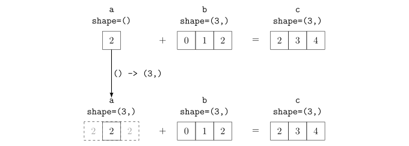
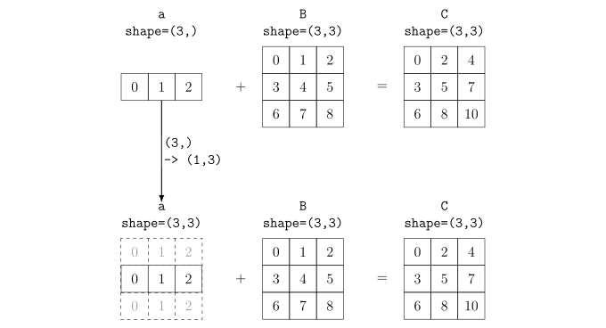
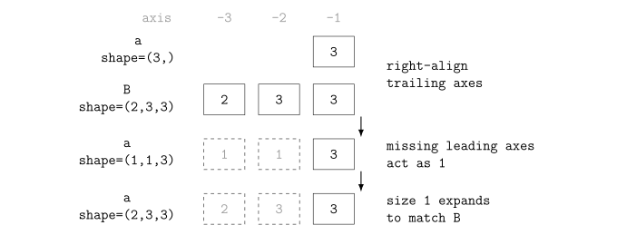
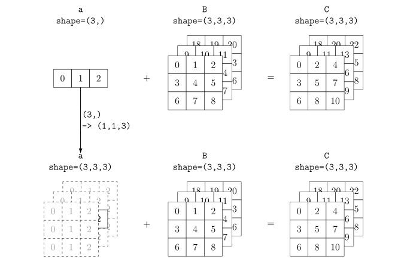
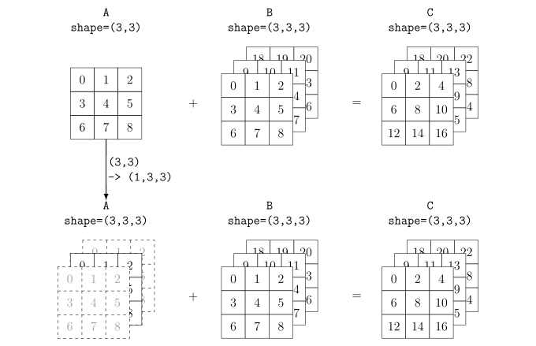
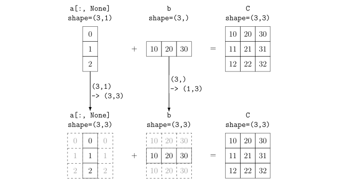
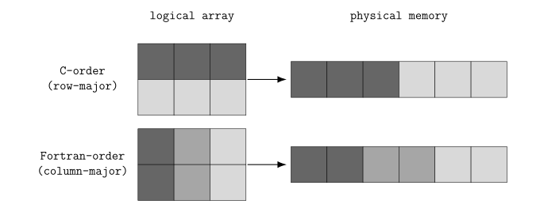
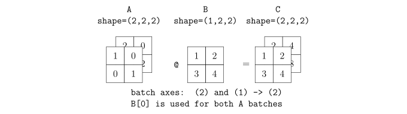

# ブラインド音源分離の高速な NumPy 実装

BSS と独立ベクトル分析の理論を学習済みでも，アルゴリズムの実装を始めたばかりの読者にとっては，疑似コードどおりの Python の `for` 文が最も理解しやすい．
ただし，研究が進むにつれ，大規模で複雑化した実験を行ったり複数の手法を比較する必要が出てくる．
そのような場合に備えてNumPyで実装を高速化することは大きく役に立つはずである．
また，高速に実装するには，Python の `for` 文を配列演算へ置き換えるだけではなく，配列の shape と axis，演算の計算量，データのコピーを確認し，同じ結果を保ったまま書き換えるための体系だった知識が必要である．
この文書では，そのようなBSSアルゴリズムに典型的な線形代数演算をNumPyで高速化するための方法論を紹介する．
最終的には **補助関数型独立ベクトル分析** (auxiliary-function-based independent vector analysis, AuxIVA) を題材として，Python の `for` 文から NumPy の配列演算へ書き換える方法を学ぶ．
以下の知識を前提とする．

- 線形代数
  - 行列・ベクトルの演算
  - 固有値・固有ベクトル
  - 逆行列
- ディジタル信号処理
  - 離散Fourier変換
  - スペクトル解析
  - マイクロホンアレイ信号処理
  - ブラインド音源分離
  - 独立ベクトル分析

この資料では，次の順序で小さなコードブロックを実行する．

1. Python の `for` 文と NumPy の実行時間を測る．
2. NumPy 配列，要素ごとの配列演算，broadcast の規則を確認する．
3. ベクトルと行列の演算を定義式，計算量，NumPy コードへ対応づける．
4. copy とメモリ配置の影響を確認する．
5. AuxIVA の重み付き共分散行列と分離行列の更新を段階的に高速化する．

対話型実行環境 (read-eval-print loop, REPL) または Jupyter notebook などで実行するコードブロックは，適宜上から順に実行せよ．
一方，コードブロックの先頭が `# profile_numpy.py` や `# examples/auxiva_loop.py` のようなファイル名のコメントである場合は，その名前のファイルを適当な箇所で作成し，コードブロック全体を保存せよ．
同じファイル名が複数回現れる場合は，本文で書き換えを指示していない限り，現れる順序で同じファイルへ追記する．
これらのコードブロックは REPL で個別に実行せず，必要な定義がそろった後，適当なコマンドでファイルを実行する．
以下では，最初に NumPy を import したものとして記述する．

```py
import numpy as np
```

以下の数式では，ベクトルと行列の添字を 1 始まりとする．
例えば，長さ $N$ のベクトルの添字 $i$ は $i = 1, \ldots, N$ の範囲を取る．
疑似コード，Python，NumPy の添字は 0 始まりとする．
したがって，数式の $x _ {t,f,k}$ はコードの `x[t - 1, f - 1, k - 1]` に対応する．

## 実行時間の計測

高速化では，変更前後の結果と実行時間を同じ入力で比較する．
ここではまず，NumPyベクトル演算の恩恵を感じてもらうために，簡単な演算を実装して比較してみよう．
長さ $N$ のベクトル $\mathbfit{x}$ の二乗和を考える．

$$
s = \sum _ {i = 1} ^ {N} x _ {i} ^ 2.
$$

Python の `for` 文では，要素の取り出し，加算，`for` 文の制御を Python が $N$ 回繰り返す．

```py
def sum_of_squares_loop(x):
    total = 0.0
    for value in x:
        total += value * value
    return total
```

NumPy では，要素積と集約演算を配列全体へ適用する．

```py
def sum_of_squares_numpy(x):
    return np.sum(x * x)
```

コードの上では反復が無いかのように見えるが，NumPy 版でも $N$ 個の要素を処理する反復自体はなくならない．
Python の `for` 文による実装では，各反復の制御，要素の取得，乗算，加算を Python interpreter が一つずつ実行する．
NumPy 版では，Python から `x * x` と `np.sum()` を一回ずつ呼び出し， $N$ 個の要素に対する反復を NumPy 内部のコンパイル済み処理に任せる．
`ndarray` は全要素が一つの dtype を共有するため，NumPy は配列演算を始める時点で低水準の実装を選べる．
その後は要素ごとに Python の演算子を呼び出さないため，反復制御と演算方法の選択に伴う overhead を減らせる．

上記の関数を用いて，次のコードで長さ 100,000 の入力を作り，二つの関数を実行してみよう．

```py
N = 100000
x = np.linspace(-1.0, 1.0, N)
loop_result = sum_of_squares_loop(x)
numpy_result = sum_of_squares_numpy(x)
```

実行環境によって実際の動作は変わるので，上の `N` を適宜変化させながら比較してみてほしい．
ほとんどの環境で， `sum_of_squares_loop` の方が時間がかかるはずである．

次に，これらの演算結果が高速化によって変わらないことを確かめよう．
浮動小数点演算では加算順序によって丸め誤差が変わるため，完全一致ではなく差の大きさを調べる．

```py
print(loop_result, numpy_result)
print(abs(loop_result - numpy_result))
```

最初の行にはほぼ同じ二つの二乗和が表示され，最後の行には丸め誤差程度の小さな差が表示されるはずである．

### `timeit`

短い処理の速度比較には，Python 標準ライブラリの `timeit` を使う[^python-timeit]．
入力配列の作成を計測から除き，同じ関数を複数回実行する．

```py
from timeit import repeat

n_calls = 10
loop_times = repeat(lambda: sum_of_squares_loop(x), repeat=5, number=n_calls)
numpy_times = repeat(lambda: sum_of_squares_numpy(x), repeat=5, number=n_calls)

loop_seconds = min(loop_times) / n_calls
numpy_seconds = min(numpy_times) / n_calls

print(f"Python for statement: {loop_seconds * 1_000:.3f} ms")
print(f"NumPy:      {numpy_seconds * 1_000:.3f} ms")
print(f"speedup:    {loop_seconds / numpy_seconds:.1f} times")
```

表示される時間と倍率は，**中央処理装置** (central processing unit, CPU)，NumPy，実行中の負荷によって変わる．
通常は NumPy 版の時間が小さく，`speedup` は 1 より大きくなる．
最小値は外乱が少ない場合の処理時間に近く，中央値は普段観測しやすい処理時間に近い．
どちらを使った場合も，入力 shape，**データ型** (data type, `dtype`)，反復回数を記録する．

### `line_profiler`

`line_profiler` は，指定した Python 関数について，各行の実行回数と実行時間を計測する[^line-profiler]．
以下では，`uv run --with` を使い，NumPy と `line_profiler` を実行環境へ一時的に追加する．

`@profile` のように，関数定義の直前へ `@` で始まる式を書く記法を **decorator**と呼ぶ[^python-decorator]．
decorator の式は関数定義時に評価され，その評価結果である callable が定義された関数オブジェクトを受け取る．
その callable の戻り値が，元の関数オブジェクトの代わりに関数名へ束縛される．
`@profile` を `def func(...):` の直前に置く操作は，おおむね `func = profile(func)` と同じである．
この例の `profile` は，対象関数が呼び出されたときに各行の実行時間を記録できるようにする．

計測対象を次のファイルへ保存する．

```py
# profile_numpy.py
import numpy as np
from line_profiler import profile


@profile
def sum_of_squares_loop(x):
    total = 0.0
    for value in x:
        total += value * value
    return total


@profile
def sum_of_squares_numpy(x):
    return np.sum(x * x)


x = np.linspace(-1.0, 1.0, 1_000_000)
sum_of_squares_loop(x)
sum_of_squares_numpy(x)
```

`kernprof` の `-l` で行単位の計測を有効にし，`-v` で結果を表示する．

```sh
uv run --with numpy --with line_profiler kernprof -l -v profile_numpy.py
```

正しく実行されると，計測結果を `profile_numpy.py.lprof` へ保存し，`-v` によって同じ内容を標準出力へ表示される．
実行時間は環境によって変わるが，実行結果は概ね次のようになるはずである．

```text
Wrote profile results to 'profile_numpy.py.lprof'
Timer unit: 1e-06 s

Total time: 0.28549 s
File: profile_numpy.py
Function: sum_of_squares_loop at line 6

Line #      Hits         Time  Per Hit   % Time  Line Contents
==============================================================
     6                                           @profile
     7                                           def sum_of_squares_loop(x):
     8         1          1.0      1.0      0.0      total = 0.0
     9   1000001     130123.0      0.1     45.6      for value in x:
    10   1000000     155365.0      0.2     54.4          total += value * value
    11         1          1.0      1.0      0.0      return total

Total time: 0.00082 s
File: profile_numpy.py
Function: sum_of_squares_numpy at line 14

Line #      Hits         Time  Per Hit   % Time  Line Contents
==============================================================
    14                                           @profile
    15                                           def sum_of_squares_numpy(x):
    16         1        820.0    820.0    100.0      return np.sum(x * x)
```

`Timer unit: 1e-06 s` は，`Time` と `Per Hit` の 1 単位が $10 ^ {-6}$ 秒であることを表す．
例えば，`for` 文の 9 行目にある `Time = 130123.0` は $0.130123$ 秒に相当する．

| 項目               | 意味                                 | 読むときの注意                                       |
| :----------------- | :----------------------------------- | :--------------------------------------------------- |
| `Total time`       | 対象関数内で計測した時間の合計       | 秒単位で表示され，関数ごとに集計される               |
| `File`，`Function` | 計測対象のファイル，関数，定義開始行 | 同名関数が複数ある場合の識別に使う                   |
| `Line #`           | ソースコードの行番号                 | 保存したファイルの行番号と対応する                   |
| `Hits`             | その行を実行した回数                 | `for` 文の行と本体では回数が異なる場合がある         |
| `Time`             | その行で費やした累積時間             | `Timer unit` を掛けると秒へ変換できる                |
| `Per Hit`          | `Time / Hits`                        | 表示桁で丸められるため，短い処理では 0 に近くなる    |
| `% Time`           | 関数の `Total time` に占める割合     | プログラム全体ではなく，その関数内の割合である       |
| `Line Contents`    | 計測したソースコード                 | 関数呼び出しの行には，呼び出し先の実行時間も含まれる |

decorator，`def`，空行には関数の実行中に対応する処理がないため，時間の欄が空になる．

計測結果は，関数全体，時間を使った行，その行が遅い理由の順に読む．
最初に `Total time` を見て，計測対象の関数が処理全体に対して調べる価値のある長さか確認する．
`% Time` は関数ごとの割合なので，`Total time` が異なる関数どうしを `% Time` だけで比較しない．
この例では，NumPy 版の 100% に当たる $0.00082$ 秒より，`for` 文版の 45.6% に当たる $0.130123$ 秒の方が長い．

次に，`Time` と `% Time` が大きい行を探し，`Hits` と `Per Hit` から時間が増えた理由を分ける．
`Hits` が大きく `Per Hit` が小さい場合は，短い Python 処理を多数回繰り返している．
`Hits` が小さく `Per Hit` が大きい場合は，一回の関数呼び出し，大きな配列演算，copy などが時間を使っている．

`for` 文版では，9 行目の `for` 文が 1,000,001 回，10 行目の乗算と加算が 1,000,000 回実行されている．
`for` 文の行は，全要素を処理した後に反復を終了する確認が一回入るため，本体より `Hits` が一回多い．
二つの行で関数時間のほぼすべてを使っているため，これらの反復を NumPy の配列演算へ移す．

NumPy 版では，`np.sum(x * x)` の一行だけが一回実行され，関数内の割合は 100% になる．
この表示は，NumPy 内部で反復がないことや，`x * x` と `np.sum()` の時間が等しいことを意味しない．
Python から見える一行の内側で，NumPy による要素ごとの乗算と総和が実行されている．
二つを分けて調べる場合は，`profile_numpy.py` にある `sum_of_squares_numpy()` の定義を次のコードブロックで置き換えてから再計測する．
このコードブロックはファイルの末尾へ追記しない．

```py
# profile_numpy.py
@profile
def sum_of_squares_numpy(x):
    squared = x * x
    return np.sum(squared)
```

この変更では乗算と総和が別の行になるため，再計測後の表には `squared = x * x` と `return np.sum(squared)` の時間が分かれて表示される．

`line_profiler` は各行へ計測処理を追加するため，短い行を大量に反復する Python の `for` 文では計測 overhead の影響が大きくなる．
この結果は遅い行の位置を特定するために使い，変更前後の最終的な速度比較には `timeit` を使う．

## NumPy 基礎

NumPy は，同じ dtype の要素を並べた **N 次元配列** (N-dimensional array, `ndarray`) と，配列全体を処理する演算を提供する[^numpy-overview]．
BSS の実装では，各軸の意味を固定してから配列演算を書く．

### shape と axis

配列の各次元の長さを並べたものを **shape**，shape の各位置を **axis** と呼ぶ．
axis は 0 から数え，負の値を使うと末尾から数えられる．

`ndim` は軸数，`size` は全要素数，`dtype` は要素の型，`nbytes` はデータ領域の byte 数を表す．

```py
a = np.arange(24, dtype=np.float64).reshape(2, 3, 4)

print(a.shape, a.ndim, a.size)
print(a.dtype, a.itemsize, a.nbytes)
print(a.sum(axis=-1))
```

最初の行には `(2, 3, 4) 3 24`，次の行には `float64 8 192` が表示される．
最後には末尾軸の 4 要素を加算した shape `(2, 3)` の配列が表示される．

### dtype と ufunc

`ndarray` の全要素は一つの **dtype** を共有する．
代表的な数値型には `int16`，`float32`，`float64`，`complex64`，`complex128` がある．
型名の数字は 1 要素の bit 数であり，`float32` は 4 byte，`float64` は 8 byte を使う．

NumPy は，**universal function** (ufunc) を呼び出した時点で dtype に対応するコンパイル済みの反復処理を選ぶ．
各要素について Python object の型を調べたり，Python の演算子を呼び出したりせず，同じ機械語の演算を繰り返せるため，Python の `for` 文より高速になることが多い．
固定幅の値が連続していれば CPU cache へ読み込みやすい．
演算によっては，**単一命令複数データ** (single instruction, multiple data, SIMD) 方式で複数要素を一命令で処理できる．
行列積などでは，**基本線形代数サブプログラム** (basic linear algebra subprograms, BLAS) の最適化された実装も利用できる．
NumPy の算術演算子と `np.sin()` などの関数は，各要素へ同じ演算を適用する ufunc として実装されている．

```py
x32 = np.linspace(0.0, 1.0, 1_000, dtype=np.float32)
x64 = x32.astype(np.float64)
x_object = x64.astype(object)

print(x32.dtype, x32.nbytes)
print(x64.dtype, x64.nbytes)
print(x_object.dtype)
```

`x32` は `float32` で 4,000 byte，`x64` は `float64` で 8,000 byte と表示される．
最後の行は `object` となる．
`float32` は `float64` よりメモリ転送量を減らせるが，すべての演算が必ず速くなるわけではない．
CPU，演算，BLAS，計算精度を含めて実データで比較する．
`astype()` は dtype を変換した配列を返す．
大きな配列を反復内で何度も変換せず，処理の入口で dtype を決めるべきである．

`sum(axis=...)` や `mean(axis=...)` などの **集約演算** は，指定した軸を縮約する．
集約演算を伴う実装は，意図しない軸の変化を含む場合があるので注意が必要である．
次のコードは，shape `(5, 4, 2)` の配列に対し，最初の軸の平均，2番目の軸の和，3番目の軸の和をそれぞれ計算する．

```py
x = np.ones((5, 4, 2))

print(x.mean(axis=0).shape)
print(x.sum(axis=1).shape)
print(x.sum(axis=2).shape)
```

縮約した軸が結果から消えるため，出力 shape は順に `(4, 2)`，`(5, 2)`，`(5, 4)` になる．

### broadcast

**broadcast** は，shape の異なる配列を，要素を実際に反復して保存せずに対応づける仕組みである[^numpy-broadcasting]．
shape を末尾の軸から比較し，各軸が次のいずれかを満たせば両立する．

- 両方の長さが等しい．
- どちらか一方の長さが 1 である．
- どちらか一方にその軸が存在しない．

broadcast の前後を二段で示す図では，上段にコードに現れる入力，下段に broadcast 後の概念上の配列と演算結果を示す．
実線の黒いセルは元の配列に存在する要素，破線の灰色のセルは broadcast によって論理的に反復される要素を表す．
矢印のラベルは shape の変化を表し，破線セルのために入力データが物理的に copy されることを意味しない．

shape `(3, 3)` と `(2,)` は末尾軸の長さが一致しないため，broadcast できない．


図では，shape `(3, 3)` の `A` と shape `(2,)` の `b` を右端でそろえ，`(3, 3)` と `(1, 2)` として比較する．
末尾軸の長さは `3` と `2` であり，等しくなく，どちらも `1` ではないため，結果の代わりに `Error` となる．

scalar は軸を持たず，配列のすべての要素に対応する．



図では，shape `()` の scalar `a = 2` を，shape `(3,)` の vector `b = [0, 1, 2]` に対応する `[2, 2, 2]` とみなす．
要素ごとの加算結果は `c = [2, 3, 4]` となり，出力の shape は `(3,)` になる．

vector と matrix を演算すると，vector の軸は matrix の末尾軸に対応する．



図の vector `a = [0, 1, 2]` は，shape を右端でそろえると `(1, 3)` になり，先頭軸だけが `1` から `3` へ広がる．
このため，`a` は `B` の各行へ加算され，結果は `[[0, 2, 4], [3, 5, 7], [6, 8, 10]]` となる．
要素で書けば，`C[i, j] = a[j] + B[i, j]` である．

存在しない先頭軸は，長さ 1 の軸として扱われる．
shape `(3,)` と `(2, 3, 3)` の演算では，`(3,)` を右端へそろえた `(1, 1, 3)` とみなす．



図中の灰色の shape 要素は，暗黙的に補われた長さ `1` の軸を表す．
`(3,)` はまず `(1, 1, 3)` として扱われ，第 0 軸が `1` から `2`，第 1 軸が `1` から `3` へ広がり，第 2 軸の `3` はそのまま対応する．
したがって，vector は shape `(2, 3, 3)` の二つの部分行列と各部分行列の三つの行へ反復される．



この図では，shape `(3,)` の vector を `(1, 1, 3)` とみなし，shape `(3, 3, 3)` へ広げる．
vector の要素は tensor の末尾軸に対応するため，各部分行列の各行に同じ vector が加算され，`C[k, i, j] = a[j] + B[k, i, j]` となる．



この図では，shape `(3, 3)` の matrix を `(1, 3, 3)` とみなし，先頭軸を `1` から `3` へ広げる．
matrix の二軸は tensor の末尾二軸へそのまま対応するため，各部分行列に同じ matrix が加算され，`C[k, i, j] = A[i, j] + B[k, i, j]` となる．

broadcast は入力をcopyせず，出力は broadcast 後の shape になる．
例えば， shape `(N, 1)` と `(1, N)` の差は shape `(N, N)` になり，出力だけで $N ^ 2$ 要素を必要とする．

### `None` と `...`

`np.newaxis` は Python の `None` を指す別名であり，`np.newaxis is None` は `True` になる．
NumPy は添字の `None` を，その位置へ長さ 1 の軸を追加する指定として解釈する．
`x[:, None]` と `x[:, np.newaxis]` は同じ操作であり，どちらもデータをコピーしない．
この資料では，短い `None` を使う．

`...` は NumPy 固有の記法ではなく，Python のリテラルである．
評価すると組み込み定数 `Ellipsis` になり，`... is Ellipsis` は `True` になる．
NumPy の添字では，一つの `...` が，省略された 0 個以上の `:` に置き換わる．
したがって，3 次元配列の `a[..., 0]` は `a[:, :, 0]`，`a[0, ...]` は `a[0, :, :]` と等しい．
一つの添字の中で使える `...` は一つだけである．

`...` を使うと，配列の軸数を明示せずに先頭側の全軸を保持できる．
`a[..., None]` は末尾へ長さ 1 の軸を追加するため，batch 軸の数に依存しない行列ベクトル積を書きやすい．

```py
print(np.newaxis is None)
print(... is Ellipsis)
```

二行とも `True` になり，`np.newaxis` と `...` の実態を確認できる．

次のコードは，shape `(4, 3, 2)` の信号に対して，最後の軸への係数と最初の軸への係数を別々に掛ける．
フレーム係数には `[:, None, None]` を付け，2番目と3番目の軸に対応する長さ 1 の軸を明示的に追加する．

```py
x = np.ones((4, 3, 2))
channel_gain = np.array([1.0, 0.5])
frame_gain = np.linspace(0.0, 1.0, 4)

y = x * channel_gain
z = x * frame_gain[:, None, None]

print(y.shape, y[0, 0])
print(z.shape, z[:, 0, 0])
```

`y` と `z` の shape はどちらも `(4, 3, 2)` になる．
`y[0, 0]` には `[1.0, 0.5]`，`z[:, 0, 0]` には 0 から 1 まで等間隔に増える 4 要素が表示される．

先頭へ軸を追加すると `(1, N)`，末尾へ追加すると `(N, 1)` になる．


図の `a[None, :]` は，shape `(3,)` の `a = [0, 1, 2]` を shape `(1, 3)` の横一列へ変える．
もう一方の `b = [10, 20, 30]` も `(1, 3)` として対応するため，長さが `1` より大きい軸の反復は起こらず，結果は shape `(1, 3)` の `[[10, 21, 32]]` になる．



図の `a[:, None]` は，同じ `a` を shape `(3, 1)` の縦一列へ変える．
shape `(3,)` の `b` は `(1, 3)` として対応するため，`a` は列方向，`b` は行方向へそれぞれ反復され，出力の shape は `(3, 3)` になる．
各要素は `C[i, j] = a[i] + b[j]` であり，結果は `[[10, 20, 30], [11, 21, 31], [12, 22, 32]]` になる．

```py
x = np.array([1, 2, 3])
row = x[None, :]
column = x[:, None]

print(x.shape, x.T.shape)
print(row.shape, column.shape)
```

出力は `(3,) (3,)` と `(1, 3) (3, 1)` になる．

1 次元配列へ `.T` を適用しても shape は変わらない．
複素ベクトルでも `x.conj().T` と `x.conj()` の shape と値は等しい．
エルミート転置後の行を 2 次元配列として表す場合は `x.conj()[None, :]`，列を表す場合は `x[:, None]` と書く．
また，`(N,)` と `(N, 1)` の加算結果は `(N, N)` になる．

```py
result = x + column

print(result)
print(result.shape)
```

`column` は列方向，`x` は行方向へ broadcast され，結果は `[[2, 3, 4], [3, 4, 5], [4, 5, 6]]`，shape は `(3, 3)` になる．

shape が計算可能でも，意図した演算とは限らない．
各式について，入力と出力の軸が何を表すかを確認する．

### view と copy

配列演算が短く書けても，大きな copy を反復ごとに作ると，メモリ転送にかかる時間が無視できなくなる場合がある．
NumPy 配列は，要素を格納するデータ領域と，shape，dtype，strides などの metadata から構成される[^numpy-copies-views]．
**view** は元の配列とデータ領域を共有し，**copy** は独立したデータ領域を持つ．

```py
a = np.arange(8)
view = a[2:6]
copied = a[2:6].copy()

view[0] = 100
copied[1] = 200

print(a, view, copied)
print(np.shares_memory(a, view))
print(np.shares_memory(a, copied))
```

`view[0] = 100` は `a[2]` も変更するが，`copied[1] = 200` は `a` に影響しない．
メモリ共有の判定は順に `True`，`False` になる．

`np.shares_memory(a, b)` は，二つの配列が同じメモリ領域の少なくとも一部を共有するときに `True` を返す．

`reshape()` は，元のメモリ配置のまま新しい shape を表せる場合に view を返し，表せない場合に copy を作る．

`ndarray` の転置はデータ領域を並べ替えず，shape と strides を変えた view を返す．

`flatten()` は常に copy を返し，`ravel()` は可能な場合に view を返す．
性能やデータの更新範囲に関係する場合は，`np.shares_memory()` で確認する．
次のコードは，`flatten()`，`ravel()`，`np.asarray()` の結果が元の配列とデータを共有するか確認する．

```py
a = np.arange(24).reshape(4, 6)
flattened = a.flatten()
raveled = a.ravel()
same_array = np.asarray(a)

print(np.shares_memory(a, flattened))
print(np.shares_memory(a, raveled))
print(same_array is a)
```

出力は順に `False`，`True`，`True` になる．
`flatten()` は copy を作り，この連続配列に対する `ravel()` は view，`np.asarray()` は元の配列そのものを返す．

### basic indexing

NumPy の indexing では，添字の種類によって読み出し結果が view になるか copy になるかが変わる．
**basic indexing** は，整数，`start:stop:step` 形式の slice，またはそれらの組を使う選択である[^numpy-indexing]．
`...` と `None` を組み合わせても basic indexing のままである．
整数は指定した位置を選び，対応する軸を結果から取り除く．
slice は開始位置と strides を表す metadata だけを変更し，元のデータ領域を共有する．
すべての軸を整数で指定した場合は scalar を返すが，結果が `ndarray` であれば view になる．

```py
a = np.arange(20).reshape(4, 5)
row = a[1]
strided = a[::2, 1:5:2]
last_column = a[..., -1]
with_axis = a[:, None, :]

print(row.shape, strided.shape)
print(last_column.shape, with_axis.shape)
print(np.shares_memory(a, row))
print(np.shares_memory(a, strided))
```

出力 shape は順に `(5,)`，`(2, 2)`，`(4,)`，`(4, 1, 5)` になる．
`row` と `strided` はどちらも basic indexing で得た view なので，メモリ共有の判定は二つとも `True` になる．
view の作成は要素数によらず，基本的には shape，offset，strides などの metadata を作る $O(1)$ の処理である．
ただし，間隔を空けた slice や逆順の slice は非連続な view になるため，後続の配列演算が連続メモリより遅くなる場合がある．
小さな view を長期間保持すると元配列のデータ領域全体も解放されないため，元配列が不要なら明示的な `copy()` がメモリ量を減らす場合もある．

### row-major と column-major

二次元配列を一次元のメモリへ並べる順序には，**row-major (C-order)** と **column-major (Fortran-order)** がある．
row-major は同じ行の要素を隣接させ，column-major は同じ列の要素を隣接させる．

NumPy では，list などの配列でない object から `np.array()` を作ると，`order="F"` を指定しない限り C-order になる[^numpy-array]．
row-major は C と C++ の既定の配置でもあるため，NumPy では C-order と呼ぶ．
ただし，これはすべての `ndarray` が C-order になるという意味ではない．
NumPy は strides を使って C-order，Fortran-order，非連続な配列を表現でき，既存の配列から `np.array()` を作る場合は元のメモリ配置を保つこともある．



図の左側は shape `(2, 3)` の論理配列であり，濃淡によって二つの行を区別している．
C-order では同じ行の三要素を順に格納するため，同じ濃さのセルが三つずつ物理メモリ上で隣接する．
Fortran-order では同じ列の二要素を順に格納するため，二つの濃さのセルが交互に並ぶ．
したがって，C-order では末尾軸，Fortran-order では先頭軸の index を一つ進めたときに隣の要素へ移動する．

1 要素の byte 数を $s$ とすると，shape `(M, N)` の strides は次のようになる．

| メモリ順序                  | 連続する方向 | strides      |
| :-------------------------- | :----------- | :----------- |
| row-major，C-order          | 末尾軸       | `(N * s, s)` |
| column-major，Fortran-order | 先頭軸       | `(s, M * s)` |

`strides` は，各軸の index を一つ進めたときにデータ位置が何 byte 動くかを表す．

```py
a_c = np.arange(12, dtype=np.float64).reshape(3, 4)
a_f = np.asfortranarray(a_c)
transposed = a_c.T

print(a_c.strides, a_c.flags.c_contiguous)
print(a_f.strides, a_f.flags.f_contiguous)
print(transposed.strides, transposed.flags.f_contiguous)
print(np.shares_memory(a_c, transposed))
```

`a_c` は C-order，`a_f` と `transposed` は Fortran-order の連続配列として `True` が表示される．
`transposed` は copy ではないため，最後のメモリ共有の判定も `True` になる．

軸の順序によって処理時間が変わる理由は，反復処理がアドレスを進める間隔と，配列要素をメモリから CPU へ運ぶ単位にある．
CPU cache は通常，一要素ずつではなく，連続した複数 byte からなる **cache line** 単位でデータを読み込む．
cache line の大きさは CPU によって異なり，例えば Intel 64 architecture の CPU では 64 byte である[^intel-optimization]．
C-order 配列の末尾軸では，隣の要素までの stride が通常は一要素分なので，一度読み込んだ cache line 内の複数要素を順に利用できる．
規則的な連続アクセスでは，**hardware prefetcher** が後続の cache line を先読みしやすく，NumPy 内部の反復処理も SIMD 命令によって複数要素を一括処理しやすい．

一方，大きな stride で離れたアドレスを走査すると，各 cache line から一部の要素しか使わず，読み込んだデータの多くがその走査では利用されない．
そのようなアクセスでは先読みも効きにくく，cache miss のたびに下位 cache や主記憶からの転送を待つ可能性が高くなる．
そのため，メモリ転送が支配的な処理では，同じ演算量でも軸の順序によって実行時間が変わる．

ただし，これは「最も長い軸を常に末尾へ置く」という規則を意味しない．
C-order では，処理の内側で頻繁に連続走査する軸を末尾へ置き，各処理へ渡す小行列を連続した block にする．

- 長い時間波形へ **高速 Fourier 変換** (fast Fourier transform, FFT) や集約演算を適用する場合は，shape `(n_chan, n_samples)` として sample 軸を末尾へ置く．
- AuxIVA の分離行列は shape `(n_freq, n_chan, n_chan)` とし，各周波数の小行列を連続した block にする．
- STFT を shape `(n_frames, n_freq, n_chan)` とすると，行列ベクトル積の縮約対象である channel 軸が末尾になる．

`np.moveaxis()` や転置は，shape と strides を変えた view を作るだけである．
移動後の末尾軸が連続するとは限らない．
`np.ascontiguousarray()` は C-order でない入力を copy するため，同じ配置で多数回処理して copy 時間を回収できる場合に限って候補にする．

```py
stft = np.empty((100, 32, 2), dtype=np.complex64)
time_last = np.moveaxis(stft, 0, -1)
time_contig = np.ascontiguousarray(time_last)

print(stft.strides)
print(time_last.shape, time_last.strides)
print(time_last.flags.c_contiguous)
print(time_contig.flags.c_contiguous)
```

`time_last` の shape は `(32, 2, 100)` になるが，軸の移動だけでは C-order の連続配列にならないため，後ろから二行目は `False` になる．
`np.ascontiguousarray()` 後の最後の行は `True` になる．

### BLAS, LAPACK, oneMKL

BLAS は，ベクトルの内積，行列ベクトル積，行列積などの基本的な線形代数演算を定めた routine 群である．
**線形代数パッケージ** (Linear Algebra PACKage, LAPACK) は，BLAS を利用して連立一次方程式，固有値問題，特異値分解などを計算する routine 群である [^numpy-linalg]．
NumPy の `@` と `np.dot()` は，dtype，shape，メモリ配置などの条件が合う場合に BLAS 実装を利用する．
`np.linalg.solve()` など，連立一次方程式の求解や行列分解を行う `np.linalg` の関数は，LAPACK のroutine を利用する．
**Intel oneAPI Math Kernel Library** (oneMKL) は，Intel が提供する数値計算ライブラリであり，BLAS，LAPACK，FFT などの実装を含む [^onemkl-overview]．
以前の名称は Intel Math Kernel Library (Intel MKL) であり，MKL とも呼ばれる．
NumPy が oneMKL を BLAS／LAPACK の backend として利用する場合，Python から呼び出した行列積や行列分解は oneMKL のroutine へ渡される．
ただし，「NumPy は常に oneMKL を利用する」とは限らない．
NumPy が利用する BLAS／LAPACK 実装は，NumPy の配布方法，platform，build 設定によって異なり，oneMKL のほかに OpenBLAS や Accelerate などが使われる[^numpy-blas-lapack]．
実行中の NumPy が利用する backend は，次のコードで確認できる．

```py
np.show_runtime()
np.show_config()
```

`np.show_runtime()` は，実行中の NumPy，CPU で利用可能な SIMD 拡張，読み込まれた BLAS／LAPACK ライブラリなどの情報を表示する[^numpy-show-runtime]．
次は，x86-64 Linux 上で oneMKL を利用する環境を想定した抜粋例である．
path と一部の CPU 情報を省略しており，version，thread 数，利用可能な命令は実行環境によって変わる．

```text
[{'numpy_version': '2.5.1',
  'python': '3.13.1 (...)',
  'uname': uname_result(system='Linux', ..., machine='x86_64')},
 {'simd_extensions': {
     'baseline': ['SSE', 'SSE2', 'SSE3'],
     'found': ['SSSE3', 'SSE41', 'AVX', 'AVX2'],
     'not_found': ['AVX512F']}},
 {'filepath': '/path/to/libmkl_rt.so',
  'prefix': 'libmkl_rt',
  'user_api': 'blas',
  'internal_api': 'mkl',
  'version': '2024.0-Product',
  'num_threads': 8,
  'threading_layer': 'intel'}]
```

`np.show_runtime()` の出力の意味は次の通りである．

| 項目 | 意味 |
| :--- | :--- |
| `numpy_version` | 実行中の NumPy の version |
| `python`，`uname` | Python の version，OS，machine architecture など |
| `simd_extensions.baseline` | この NumPy が実行の前提とする SIMD 命令セット |
| `simd_extensions.found` | CPU と NumPy の組み合わせで利用可能な追加の SIMD 命令セット |
| `simd_extensions.not_found` | NumPy が対応候補とするが，この実行環境では利用できない SIMD 命令セット |
| `user_api` | NumPy から使う API の種類．`blas` なら BLAS |
| `internal_api` | 読み込まれた実装．`mkl` なら oneMKL，`openblas` なら OpenBLAS |
| `version` | BLAS／LAPACK 実装の version |
| `num_threads` | ライブラリに設定された thread 数の上限．すべての演算が常にこの数の thread を使うわけではない |
| `threading_layer` | `intel`，`pthreads`，`openmp` などの thread 実装 |
| `filepath` | 実行時に読み込まれた共有ライブラリの path |

BLAS／LAPACK の詳細情報は，NumPy が利用できる場合に `threadpoolctl` を通じて取得される[^threadpoolctl]．
`threadpoolctl` がインストールされていない場合や，読み込まれたライブラリが検出対象でない場合は，`internal_api` や `num_threads` の dictionary が表示されないことがある．
その表示だけから「BLAS／LAPACK 実装を利用していない」と判断せず，`np.show_config()` の build 情報も確認する．

`np.show_config()` は，NumPy を build したときのライブラリ，compiler，machine，SIMD 拡張などの情報を表示する[^numpy-show-config]．
同じ oneMKL 環境では，例えば次のような出力になる．
この例でも，説明に直接関係しない field と path を省略している．

```text
Build Dependencies:
  blas:
    detection method: pkgconfig
    found: true
    name: mkl
    version: 2024.x
  lapack:
    detection method: pkgconfig
    found: true
    name: mkl
    version: 2024.x
Compilers:
  c:
    name: gcc
    version: 13.x
Machine Information:
  build:
    cpu: x86_64
    endian: little
    system: linux
  host:
    cpu: x86_64
    endian: little
    system: linux
Python Information:
  version: '3.x'
SIMD Extensions:
  baseline:
  - SSE
  - SSE2
  - SSE3
  found:
  - AVX
  - AVX2
  not found:
  - AVX512F
```

`np.show_config()` の出力の意味は次のとおりである．

| section | 意味 |
| :--- | :--- |
| `Build Dependencies` | build 時に検出した BLAS と LAPACK の名称，version，検出方法．`found: true` はその実装を検出したことを表す |
| `Compilers` | NumPy の build に使われた C，C++，Cython などの compiler |
| `Machine Information` | `build` は build を実行した machine，`host` は生成した NumPy が動作対象とする machine．cross compile では両者が異なる場合がある |
| `Python Information` | build 時に使われた Python の version や path |
| `SIMD Extensions` | build 時に NumPy へ組み込まれた baseline と追加の SIMD 命令セット |

`PyYAML` が利用できる場合，`np.show_config()` は上のような読みやすい形式で表示する．
`PyYAML` がない場合は warning の後に Python の dictionary に近い形式で表示されるが，表示される項目の意味は同じである．

benchmark では，`np.show_runtime()` から実行時の backend と thread 数を記録し，`np.show_config()` を NumPy の build 条件の補足に使う．
oneMKL や OpenBLAS などの線形代数 backend は，複数の thread を使う場合がある[^numpy-global-state]．
大きな行列では並列処理によって実行時間を減らせる場合があるが，小さな行列では routine の呼び出しや thread 管理の overhead が相対的に大きくなる．
そのため，実行時間を比較するときは，入力 shape，dtype，CPU，NumPy の version に加え，BLAS／LAPACK 実装と thread 数も記録するとよい．

## ベクトル・行列演算の計算量と実装

**時間計算量**は入力サイズに対する基本演算回数の増加率，**空間計算量**は入力以外に必要なメモリ量の増加率を表す．
以下では，一回のスカラー演算と要素アクセスを $O(1)$ とする．

一重の `for` 文の時間計算量は $O(N)$ である．

```text
for i <- 0 to N - 1
    constant_time_operation()
```

独立した二重の `for` 文は $O(NM)$ になる．

```text
for i <- 0 to N - 1
    for j <- 0 to M - 1
        constant_time_operation()
```

逐次実行する処理の計算量は加算し，入れ子にした処理の計算量は乗算する．
たとえば $O(N)$ の処理の後に $O(N ^ 2)$ の処理を実行すると，全体は $O(N + N ^ 2) = O(N ^ 2)$ になる．
同じ Big-O でも，Python の処理，メモリアクセス，SIMD，BLAS によって実行時間の定数倍は異なる．

### 転置とエルミート転置

shape `(M, N)` の $A$ の転置 $B = A ^ {\mathsf{T}}$ と，エルミート転置 $C = A ^ {\mathsf{H}}$ は次式で定義される．

$$
B _ {ji} = A _ {ij}, \qquad C _ {ji} = A _ {ij} ^ {\ast}.
$$

`A.T` は shape と strides を変えた view を作るため，作成時間と追加領域は $O(1)$ である．
`A.T.copy()` は全要素をコピーするため $O(MN)$，`A.conj().T` は通常，全要素の複素共役を作るため $O(MN)$ である．

3 次元以上の `A.T` は全軸を逆順にする．
末尾の二軸だけをエルミート転置する場合は `A.conj().swapaxes(-1, -2)` と書く．

```py
a = np.array([[1.0 + 1.0j, 2.0 - 1.0j], [3.0j, 4.0]])

print(a.T)
print(a.conj().T)
```

最初の配列は要素を転置するだけなのに対し，次の配列では転置と複素共役の両方が適用される．
実部だけの要素は変わらず，虚部の符号だけが反転する．

### 内積

二つの複素ベクトルの内積は，第1引数を複素共役にする．

$$
\mathbfit{x} ^ {\mathsf{H}}\mathbfit{y}
= \sum _ {i = 1} ^ {N}x _ {i} ^ {\ast}y _ {i}.
$$

```text
function inner_product(x, y, N)
    result <- 0
    for i <- 0 to N - 1
        result <- result + conjugate(x[i]) * y[i]
    return result
```

$N$ 回の乗算と $N - 1$ 回の加算を行うため，時間計算量は $O(N)$，追加空間計算量は $O(1)$ である．

NumPy の `x @ y`，`np.dot(x, y)`，`np.inner(x, y)` は，第1引数を自動的に複素共役にしない．
複素内積には `x.conj() @ y` または `np.vecdot(x, y)` を使う．
`np.vecdot()` は第1引数の複素共役を取り，指定した軸の成分どうしの内積を計算する[^numpy-vecdot]．
`axis` を省略すると末尾軸を使い，戻り値の shape からその軸が消える．
`np.vecdot()` は NumPy 2.0 以降で利用できる．
次のコードは，第1引数の複素共役を取ってから積を加算する `for` 文版の複素内積を定義する．

```py
def inner_product_loop(x, y):
    result = 0.0j
    for i in range(x.size):
        result += x[i].conjugate() * y[i]
    return result
```

次のコードは，長さ 50,000 の複素ベクトルを作り，`for` 文版と `np.vecdot()` の複素内積を計算して両者の絶対差を表示する．

```py
rng = np.random.default_rng(0)
real_x = rng.standard_normal(50_000)
real_y = rng.standard_normal(50_000)
complex_x = real_x + 1.0j * real_y
complex_y = real_y - 1.0j * real_x

loop_result = inner_product_loop(complex_x, complex_y)
numpy_result = np.vecdot(complex_x, complex_y)
print(abs(loop_result - numpy_result))
```

加算順序が異なる場合があるため，差は 0 または丸め誤差程度の小さな値になる．
次のコードは，二つの内積実装の 1 回あたりの実行時間と速度比を比較する．

```py
loop_seconds = min(repeat(lambda: inner_product_loop(complex_x, complex_y), repeat=5, number=1))
numpy_seconds = min(repeat(lambda: np.vecdot(complex_x, complex_y), repeat=5, number=100)) / 100

print(loop_seconds, numpy_seconds)
print(loop_seconds / numpy_seconds)
```

通常は `np.vecdot()` の実行時間が小さく，速度比は 1 より大きくなる．

### 二次形式

$N$ 次正方行列 $A$ と $N$ 次元ベクトル $\mathbfit{x}$ の二次形式は，行列ベクトル積と内積に分けられる．

$$
q = \mathbfit{x} ^ {\mathsf{H}}A\mathbfit{x}
= \sum _ {i = 1} ^ {N}\sum _ {j = 1} ^ {N}x _ {i} ^ {\ast}A _ {ij}x _ {j}.
$$

```text
function quadratic_form(A, x, N)
    temporary <- matrix_vector_product(A, x, N, N)
    result <- inner_product(x, temporary, N)
    return result
```

行列ベクトル積に $O(N ^ 2)$，内積に $O(N)$ かかるため，全体の時間計算量は $O(N ^ 2)$ である．
中間ベクトルの空間計算量は $O(N)$ である．

```py
rng = np.random.default_rng(0)
a = rng.standard_normal((4, 4)) + 1.0j * rng.standard_normal((4, 4))
x = rng.standard_normal(4) + 1.0j * rng.standard_normal(4)

quadratic = np.vecdot(x, a @ x)
quadratic
```

REPL または Jupyter notebook では，最後に二次形式の複素 scalar が表示される．
`a @ x` が行列ベクトル積，`np.vecdot(x, ...)` が $\mathbfit{x} ^ {\mathsf{H}}$ とその結果の内積に対応する．

### 行列ベクトル積

shape `(M, N)` の行列 $A$ と長さ $N$ のベクトル $\mathbfit{x}$ の積は，長さ $M$ のベクトルになる．

$$
y _ {i} = \sum _ {j = 1} ^ {N}A _ {ij}x _ {j},
\qquad i = 1, \ldots, M.
$$

```text
function matrix_vector_product(A, x, M, N)
    y <- new vector of length M
    for i <- 0 to M - 1
        y[i] <- 0
        for j <- 0 to N - 1
            y[i] <- y[i] + A[i, j] * x[j]
    return y
```

各行について長さ $N$ の内積を計算するため，時間計算量は $O(MN)$，出力の空間計算量は $O(M)$ である．
NumPy では `A @ x` と書く．

### 外積

長さ $M$ の $\mathbfit{x}$ と長さ $N$ の $\mathbfit{y}$ の外積 $C = \mathbfit{x}\mathbfit{y} ^ {\mathsf{H}}$ は，shape `(M, N)` の行列を作る．

$$
C _ {ij} = x _ {i}y _ {j} ^ {\ast}, \qquad i = 1, \ldots, M,\qquad j = 1, \ldots, N.
$$

```text
function outer_product(x, y, M, N)
    C <- new matrix with shape (M, N)
    for i <- 0 to M - 1
        for j <- 0 to N - 1
            C[i, j] <- x[i] * conjugate(y[j])
    return C
```

時間計算量と出力の空間計算量は $O(MN)$ である．
出力自体が $MN$ 要素を持つため，vector化しても必要な出力メモリは減らない．

```py
x = np.array([1.0 + 1.0j, 2.0])
y = np.array([1.0j, 2.0, 3.0])

outer = x[:, None] * y.conj()[None, :]
print(outer)
print(outer.shape)
```

`x` を列，`y.conj()` を行として broadcast するため，`outer` の shape は `(2, 3)` になる．
表示される各要素は $x _ {i}y _ {j} ^ {\ast}$ に一致する．

### 行列積

shape `(M, K)` の $A$ と shape `(K, N)` の $B$ の行列積 $C = AB$ は，shape `(M, N)` になる．

$$
C _ {ij} = \sum _ {k = 1} ^ {K}A _ {ik}B _ {kj}.
$$

```text
function matrix_matrix_product(A, B, M, K, N)
    C <- new matrix with shape (M, N)
    for i <- 0 to M - 1
        for j <- 0 to N - 1
            C[i, j] <- 0
            for k <- 0 to K - 1
                C[i, j] <- C[i, j] + A[i, k] * B[k, j]
    return C
```

$MN$ 個の出力要素について長さ $K$ の内積を計算するため，古典的な行列積の時間計算量は $O(MNK)$，出力の空間計算量は $O(MN)$ である．
正方行列同士では $O(N ^ 3)$ になる．
oneMKL や OpenBLAS などの BLAS 実装は cache，SIMD，複数 thread を利用できるが，古典的なアルゴリズムの漸近計算量は変わらない．

`@` は `np.matmul()` に対応する行列積演算子である．
2 次元配列同士では `np.dot()` も同じ結果になるが，3 次元以上の規則が異なるため，行列積には `@` を使う．


図では，`A = [[1, 2], [3, 4]]` の各行と `B = [[5, 6], [7, 8]]` の各列の内積を計算する．
例えば左上の要素は `1 * 5 + 2 * 7 = 19` であり，結果は `[[19, 22], [43, 50]]` になる．
二つの入力が 2 次元の場合は `np.dot(A, B)` と `A @ B` が同じ shape `(2, 2)` の結果を返すが，この一致を 3 次元以上へ一般化することはできない．

次のコードは，三重の `for` 文で古典的な行列積を計算する関数を定義する．

```py
def matrix_matrix_loop(a, b):
    n_rows, n_inner = a.shape
    n_columns = b.shape[1]
    result = np.zeros((n_rows, n_columns), dtype=np.result_type(a, b))
    for i in range(n_rows):
        for j in range(n_columns):
            for k in range(n_inner):
                result[i, j] += a[i, k] * b[k, j]
    return result
```

次のコードは，`for` 文版と `@` の行列積を比較し，最大絶対差を表示する．

```py
mat_a = rng.standard_normal((32, 32))
mat_b = rng.standard_normal((32, 32))

loop_result = matrix_matrix_loop(mat_a, mat_b)
numpy_result = mat_a @ mat_b
print(np.max(np.abs(loop_result - numpy_result)))
```

出力は浮動小数点数の丸め誤差程度の小さな値になる．
次のコードは，`for` 文版と `@` の 1 回あたりの実行時間と速度比を表示する．

```py
loop_seconds = min(repeat(lambda: matrix_matrix_loop(mat_a, mat_b), repeat=5, number=1))
numpy_seconds = min(repeat(lambda: mat_a @ mat_b, repeat=5, number=100)) / 100

print(loop_seconds, numpy_seconds)
print(loop_seconds / numpy_seconds)
```

通常は `@` の実行時間が小さく，速度比は 1 より大きくなる．

### バッチ行列積

`@` は末尾の二軸を行列とし，先頭側の軸を batch 軸として broadcast する．



図の `A` は shape `(2, 2, 2)` であり，二つの batch に単位行列とその 2 倍を持つ．
`B` は shape `(1, 2, 2)` であり，末尾二軸は行列積に使われ，長さ `1` の先頭軸だけが `2` へ broadcast される．
したがって，第 0 batch の結果は `B[0]`，第 1 batch の結果は `2 * B[0]` となり，出力の shape は `(2, 2, 2)` になる．

分離行列 `w` の shape を `(F, K, C)`，観測信号 `x` の shape を `(T, F, C)` とする．
列ベクトル用の軸を追加すると，全時間フレームと全周波数の行列ベクトル積をまとめて計算できる．

$$
y _ {t,f,k} = \sum _ {c = 1} ^ {C}W _ {f,k,c}x _ {t,f,c}.
$$

```py
rng = np.random.default_rng(0)
x = rng.standard_normal((5, 4, 2))
w = rng.standard_normal((4, 2, 2))

y = (w @ x[..., None])[..., 0]

print(y.shape)
print(y[3, 2])
print(w[2] @ x[3, 2])
```

`y` の shape は `(5, 4, 2)` になり，最後の二行には同じ長さ 2 のベクトルが表示される．
この一致は，batch 行列積の `y[3, 2]` が個別の `w[2] @ x[3, 2]` と同じ演算であることを示す．

時間計算量は $O(TFKC)$ であり， $K = C$ なら $O(TFC ^ 2)$ になる．
NumPy は batch 軸を走査する Python の `for` 文を除くが，計算する内積の数は変わらない．
この例は batch 軸の broadcast 規則を確認するための書き方である．
AuxIVA の実装では，時間フレームを行列にまとめ，列ベクトル用の軸を追加しない行列積へ書き換える．

### 連立一次方程式

AuxIVA の **反復射影法** (iterative projection, IP) 更新では， $A\mathbfit{x} = \mathbfit{b}$ を繰り返し解く．
一般の $N$ 次密行列に対する `np.linalg.solve()` は，行の入れ替えを含む **lower-upper decomposition**（LU 分解）と二つの三角連立方程式の求解によって解を計算する[^numpy-solve]．
NumPy はこの計算に，LAPACK の `gesv` routine を利用する[^lapack-gesv]．

$$
PA = LU,
\qquad
L\mathbfit{y} = P\mathbfit{b},
\qquad
U\mathbfit{x} = \mathbfit{y}.
$$

ここで， $P$ は行の入れ替えを表す置換行列， $L$ は下三角行列， $U$ は上三角行列である．
LU 分解の時間計算量は $O(N ^ 3)$，分解後に一つの右辺を解く時間計算量は $O(N ^ 2)$ である．
実数の加算と乗算を数える概算では，LU 分解に約 $2N ^ 3 / 3$，一つの右辺に対する前進代入と後退代入に約 $2N ^ 2$ の演算が必要になる．
shape `(N, R)` の $R$ 個の右辺を一回の `solve()` に渡す場合は，同じ LU 分解を使って各列を解くため，時間計算量は $O(N ^ 3 + N ^ 2R)$ になる．
右辺を別々の `solve()` 呼び出しへ渡すと呼び出しごとに係数行列を再び分解するため，右辺が同時に分かっている場合は shape `(N, R)` へまとめる．

一方，逆行列の各列は，単位行列の各列を右辺とする $N$ 個の連立一次方程式の解に相当する．

$$
A ^ {-1}
= \lbrack
\mathbfit{z} _ {1},
\ldots,
\mathbfit{z} _ {N}
\rbrack,
\qquad
A\mathbfit{z} _ {j} = \mathbfit{e} _ {j},
\qquad j = 1, \ldots, N.
$$

`np.linalg.inv(a) @ b` は， $\mathbfit{x}$ を求めるだけでも逆行列の $N ^ 2$ 要素をすべて計算して保存し，その後に行列ベクトル積を行う[^numpy-inv]．
`np.linalg.solve(a, b)` は必要な右辺だけを使って解を求め，逆行列を結果として生成しない．
数式の $\mathbfit{x} = A ^ {-1}\mathbfit{b}$ は， $A\mathbfit{x} = \mathbfit{b}$ を満たす解を表しており，実装でも逆行列を構成する必要があるという指示ではない．

| 観点                         | `np.linalg.solve(a, b)`     | `np.linalg.inv(a) @ b`                        |
| :--------------------------- | :-------------------------- | :-------------------------------------------- |
| 求める対象                   | 解 $\mathbfit{x}$           | 逆行列 $A ^ {-1}$ の全要素と解 $\mathbfit{x}$ |
| 単一右辺の時間計算量         | $O(N ^ 3)$                  | $O(N ^ 3)$ と追加の行列ベクトル積             |
| 式の評価で生成する主要な配列 | shape `(N,)` の解           | shape `(N, N)` の逆行列と shape `(N,)` の解   |
| 丸め誤差                     | LU 分解した係数から直接求解 | 逆行列を丸めた後，行列積でも丸めが発生        |

どちらも漸近計算量は $O(N ^ 3)$ だが，逆行列を作る経路は不要な列まで計算するため，演算数とメモリ転送量が増える．
Big-O 記法では，この定数倍の差は見えない．
逆行列そのものを後続処理で必要とする場合には `inv()` を使うが，目的が連立一次方程式の解だけなら `solve()` を使う．

浮動小数点数で計算した逆行列を $\widehat{A} ^ {-1}$ とすると，`inv(a) @ b` は $\widehat{A} ^ {-1}$ の丸め誤差を含む行列積をさらに評価する．
`solve()` は丸められた逆行列を明示的に経由しないため，一般に残差 $\mathbfit{b} - A\widehat{\mathbfit{x}}$ を小さく保ちやすい．
ただし，個々の入力で `solve()` の残差が必ず小さくなるという保証ではないため，必要な精度を満たすかは実際の残差で確認する．
`solve()` と `inv()` はどちらも，係数行列が正方かつ正則であることを前提とする．
また，`solve()` を使っても，特異行列や特異行列に近い行列の問題が解消するわけではない．
NumPy の `inv()` の仕様にも，悪条件の行列では例外が発生せず，不正確な結果を返す場合があると記載されている．

`solve()` の内部でも LU 分解を保持するために $O(N ^ 2)$ の領域が必要になる．
それでも，shape `(N, N)` の逆行列を追加の中間結果として生成しないため，`inv() @ b` より必要な配列を減らせる．

batch 軸を持つ係数行列と右辺も，一回の `solve()` へまとめて渡せる．

```py
a = np.array([[3.0, 1.0], [1.0, 2.0]])
b = np.array([9.0, 8.0])
x = np.linalg.solve(a, b)

print(x)
print(a @ x)
```

解 `x` は `[2.0, 3.0]`，`a @ x` は右辺と同じ `[9.0, 8.0]` になる．

次のコードは，比較に使う正則行列と右辺を作り，`solve()` と `inv() @` で同じ連立一次方程式を解く．
乱数行列の対角成分を大きくし，この比較で容易に特異行列が生じないようにする．

```py
rng = np.random.default_rng(0)
n = 128
matrix = rng.standard_normal((n, n))
matrix += n * np.eye(n)
rhs = rng.standard_normal(n)

x_solve = np.linalg.solve(matrix, rhs)
x_inv = np.linalg.inv(matrix) @ rhs
```

次のコードは，二つの解を元の方程式へ代入し，残差のノルムを表示する．

```py
res_solve = np.linalg.norm(matrix @ x_solve - rhs)
res_inv = np.linalg.norm(matrix @ x_inv - rhs)

print(res_solve, res_inv)
```

どちらも 0 に近い値になるが，通常は `res_solve` が `res_inv` と同程度かそれより小さくなる．
次のコードは，二つの解法をそれぞれ 5 回ずつ計測し，1 回あたりの実行時間を表示する．

```py
n_calls = 5
solve_times = repeat(lambda: np.linalg.solve(matrix, rhs), repeat=3, number=n_calls)
inv_times = repeat(lambda: np.linalg.inv(matrix) @ rhs, repeat=3, number=n_calls)

print(min(solve_times) / n_calls)
print(min(inv_times) / n_calls)
```

残差と実行時間は，入力，dtype，NumPy が利用する BLAS／LAPACK 実装，thread 数によって変わる．
通常は `solve()` の実行時間が小さくなる．

## ブラインド音源分離の高速化

ブラインド音源分離アルゴリズムの一例として AuxIVA を実装し，複数の軸を `for` 文で走査する実装から NumPy 版へ書き換える過程を説明する．
AuxIVA は，周波数ごとの分離行列と，全周波数にまたがる音源モデルを交互に更新する手法である ([Ono, 2011](https://doi.org/10.1109/ASPAA.2011.6082320))．
この節では，球対称 Laplace 音源モデルと**反復射影法** (iterative projection, IP) による一回の更新，および反復後の projection back を扱う．

`@`，`np.dot()`，`np.vecdot()`，外積，`np.linalg.solve()` の使い方は，前節までの内容を前提とする．
ここで取り除くのは，主に時間フレーム軸と周波数軸を走査する Python の `for` 文である．
まず更新全体を数式で確認し，次に各時刻・周波数のベクトル・行列演算を `@` などで書いた `for` 文版を実装する．
その後，shape を追いながら `for` 文を一つずつ batch 処理へ置き換える．

### 配列の shape と共役規約

観測チャンネル数と音源数がどちらも $K$ の決定条件を仮定する．
この節では，次の shape と軸順序を使う．

| 配列  | shape          | 数学的意味                           |
| :---- | :------------- | :----------------------------------- |
| `x`   | `(T, F, K)`    | 観測スペクトログラム                 |
| `w`   | `(F, K, K)`    | 分離行列                             |
| `y`   | `(T, F, K)`    | 分離スペクトログラム                 |
| `phi` | `(T, K)`       | 音源モデル重み                       |
| `cov` | `(K, F, K, K)` | 音源と周波数ごとの重み付き共分散行列 |

C-order の `x[t - 1, f - 1, :]` は，時間フレーム $t$ と周波数 $f$ の観測ベクトル $\mathbfit{x} _ {t,f}$ に対応する．
`w[f]` と `cov[k, f]` は，線形代数関数が行列として扱う二軸を末尾に持つ．

多くの文献では，分離行列 $W _ {f}$ の $k$ 行目を分離ベクトル $\mathbfit{w} _ {k,f}$ のエルミート転置として表す．
NumPy では `w[f, k]` に $\mathbfit{w} _ {k,f} ^ {\mathsf{H}}$ の成分を保存し，`np.linalg.solve()` が返す列ベクトルを行へ格納するときだけ複素共役を取る．
したがって，分離信号の計算では `w` をそのまま使う．

| 処理                     | NumPy で扱う値                               |
| :----------------------- | :------------------------------------------- |
| `np.linalg.solve()` の解 | $\mathbfit{w} _ {k,f}$                       |
| `w[f, k]` への代入       | $\mathbfit{w} _ {k,f} ^ {\mathsf{H}}$ の成分 |
| 分離信号の計算           | `w` をそのまま使用                           |

### AuxIVA の更新式

一回の更新で順に求める量を，実装の順序に沿って定義する．

最初に，各時間フレームと周波数の分離信号を求める．
分離行列を観測ベクトルへ掛けると，次式になる．

$$
\mathbfit{y} _ {t,f} = W _ {f}\mathbfit{x} _ {t,f}.
$$

`x` と `y` の shape はともに `(T, F, K)` である．

次に，分離信号から球対称 Laplace 音源モデルの重み $\varphi _ {t,k}$ を求める．
同じ音源の全周波数成分からノルム $r _ {t,k}$ を計算し，その逆数に比例する重みを与える．

$$
r _ {t,k}
= \sqrt{\sum _ {f = 1} ^ {F}\lvert y _ {t,f,k}\rvert ^2},
\qquad
\varphi _ {t,k}
= \frac{1}{2\max(r _ {t,k}, r _ {\mathrm{floor}})}.
$$

ノルムの下限値 $r _ {\mathrm{floor}}$ は，正の値とする．
`phi[t, k]` が $\varphi _ {t,k}$ に対応する．

続いて，音源モデル重みを使い，音源と周波数ごとの重み付き共分散行列 $V _ {k,f}$ を求める．
時間フレームごとの観測ベクトルの外積に重みを掛け，時間軸で平均する．

$$
V _ {k,f}
= \frac{1}{T}\sum _ {t = 1} ^ {T}
\varphi _ {t,k}
\mathbfit{x} _ {t,f}
\mathbfit{x} _ {t,f} ^ {\mathsf{H}}.
$$

`cov[k, f]` が $V _ {k,f}$ に対応する．
時間フレームごとの外積は $K \times K$ 行列である．

得られた重み付き共分散行列を使い，IP によって音源ごとの分離ベクトル $\mathbfit{w} _ {k,f}$ を更新する．
index $k$ に対応する基底ベクトルを $\mathbfit{e} _ {k}$ とし，連立一次方程式の解を $V _ {k,f}$ に関する二次形式で正規化する．

$$
\widetilde{\mathbfit{w}} _ {k,f}
= \left(W _ {f}V _ {k,f}\right) ^ {-1}\mathbfit{e} _ {k},
\qquad
\mathbfit{w} _ {k,f}
= \frac{\widetilde{\mathbfit{w}} _ {k,f}}
{\sqrt{
\widetilde{\mathbfit{w}} _ {k,f} ^ {\mathsf{H}}
V _ {k,f}
\widetilde{\mathbfit{w}} _ {k,f}
}}.
$$

逆行列そのものは不要であるため，`np.linalg.solve()` で連立一次方程式を解く．
音源 $k$ の更新は，直前までに更新した分離行列を使う逐次処理である．

すべての IP 反復を終えた後は，projection back によって分離信号のスケールを補正する．
projection back は IP 反復とは独立した後処理であり，一回だけ行う．
参照 microphone $m$ に対する最小二乗係数 $a _ {f,k}$ を求め，補正後の分離信号 $\widetilde{y} _ {t,f,k}$ を計算する．

$$
a _ {f,k}
= \frac{
\sum _ {t = 1} ^ {T}
x _ {t,f,m}y _ {t,f,k} ^ {\ast}
}{
\sum _ {t = 1} ^ {T}
\lvert y _ {t,f,k}\rvert ^2
},
\qquad
\widetilde{y} _ {t,f,k} = a _ {f,k}y _ {t,f,k}.
$$

最後に，ここまでに定義した量の計算順序を，更新全体の疑似コードで確認する．
反復回数を $L$ とすると，複数回の IP 更新と projection back を含む処理全体は次式で表せる．
projection back の前には，最後に更新した分離行列を使って分離信号を再計算する．

```math
\begin{aligned}
&\mathbf{input}\ \mathbfit{x} _ {t,f},
\quad(\forall t,f)
\\
&
\\
&W _ {f} \leftarrow I _ {K},
\quad(\forall f)
\\
&\mathbf{for}\ \ell = 1,\ldots,L\ \mathbf{do}
\\
&\quad
\mathbfit{y} _ {t,f}
\leftarrow W _ {f}\mathbfit{x} _ {t,f},
\quad(\forall t,f)
\\
&\quad
r _ {t,k}
\leftarrow
\sqrt{\sum _ {f = 1} ^ {F}\lvert y _ {t,f,k}\rvert ^2},
\quad(\forall t,k)
\\
&\quad
\varphi _ {t,k}
\leftarrow
\frac{1}{2\max\left(r _ {t,k},r _ {\mathrm{floor}}\right)},
\quad(\forall t,k)
\\
&\quad
V _ {k,f}
\leftarrow
\frac{1}{T}
\sum _ {t = 1} ^ {T}
\varphi _ {t,k}
\mathbfit{x} _ {t,f}
\mathbfit{x} _ {t,f} ^ {\mathsf{H}},
\quad(\forall k,f)
\\
&\quad
\mathbf{for}\ k = 1,\ldots,K\ \mathbf{do}
\\
&\qquad
\widetilde{\mathbfit{w}} _ {k,f}
\leftarrow
\left(W _ {f}V _ {k,f}\right) ^ {-1}
\mathbfit{e} _ {k},
\quad(\forall f)
\\
&\qquad
\mathbfit{w} _ {k,f}
\leftarrow
\frac{\widetilde{\mathbfit{w}} _ {k,f}}
{\sqrt{
\widetilde{\mathbfit{w}} _ {k,f} ^ {\mathsf{H}}
V _ {k,f}
\widetilde{\mathbfit{w}} _ {k,f}
}},
\quad(\forall f)
\\
&\quad
\mathbf{end\ for}
\\
&\mathbf{end\ for}
\\
&
\\
&\mathbfit{y} _ {t,f}
\leftarrow W _ {f}\mathbfit{x} _ {t,f},
\quad(\forall t,f)
\\
&a _ {f,k}
\leftarrow
\frac{
\sum _ {t = 1} ^ {T}
x _ {t,f,m}y _ {t,f,k} ^ {\ast}
}{
\sum _ {t = 1} ^ {T}
\lvert y _ {t,f,k}\rvert ^2
},
\quad(\forall f,k)
\\
&\widetilde{y} _ {t,f,k}
\leftarrow
a _ {f,k}y _ {t,f,k},
\quad(\forall t,f,k)
\\
&\mathbf{return}\
\widetilde{\mathbfit{y}} _ {t,f}
\quad (\forall t, f)
\end{aligned}
```

### `for` 文による AuxIVA の実装

まず，時間，周波数，音源の各軸を `for` 文で明示した実装を書く．
各 `for` 文の内側では，前節までに扱った行列ベクトル積，外積，内積，連立一次方程式をそのまま使う．
次のコード全体を `examples/auxiva_loop.py` として保存する．

```py
# examples/auxiva_loop.py
import numpy as np


def demix(x, w):
    n_frames, n_freq, _ = x.shape
    y = np.empty(x.shape, dtype=np.result_type(x, w))

    for t in range(n_frames):
        for f in range(n_freq):
            y[t, f] = w[f] @ x[t, f]

    return y


def source_model_weights(y, norm_floor):
    n_frames, _, n_chan = y.shape
    phi = np.empty((n_frames, n_chan), dtype=y.real.dtype)

    for t in range(n_frames):
        for k in range(n_chan):
            norm = np.sqrt(np.sum(np.abs(y[t, :, k]) ** 2))
            norm = max(norm, norm_floor)
            phi[t, k] = 1.0 / (2.0 * norm)

    return phi


def weighted_covariance(x, phi):
    n_frames, n_freq, n_chan = x.shape
    cov = np.empty((n_chan, n_freq, n_chan, n_chan), dtype=np.result_type(x, phi))

    for k in range(n_chan):
        for f in range(n_freq):
            cov[k, f] = 0.0
            for t in range(n_frames):
                x_tf = x[t, f]
                cov[k, f] += phi[t, k] * (x_tf[:, None] * x_tf.conj()[None, :])
            cov[k, f] /= n_frames

    return cov


def iterative_projection(w, cov):
    n_freq, n_chan, _ = w.shape
    w_new = w.copy()

    for k in range(n_chan):
        e_k = np.zeros(n_chan, dtype=w.dtype)
        e_k[k] = 1.0

        for f in range(n_freq):
            system = w_new[f] @ cov[k, f]
            w_vec = np.linalg.solve(system, e_k)
            denom = np.vecdot(w_vec, cov[k, f] @ w_vec).real
            w_vec /= np.sqrt(denom)
            w_new[f, k] = w_vec.conj()

    return w_new


def iteration(x, w, norm_floor):
    y = demix(x, w)
    phi = source_model_weights(y, norm_floor)
    cov = weighted_covariance(x, phi)
    return iterative_projection(w, cov)


def project_back(y, x, ref_mic):
    _, n_freq, n_chan = y.shape
    ref = x[..., ref_mic]
    y_scaled = np.empty_like(y)

    for f in range(n_freq):
        for k in range(n_chan):
            y_k = y[:, f, k]
            num = np.vecdot(y_k, ref[:, f])
            denom = np.vecdot(y_k, y_k).real
            scale = num / denom
            y_scaled[:, f, k] = scale * y_k

    return y_scaled
```

この実装では，`demix()` が $t,f$，`source_model_weights()` が $t,k$，`weighted_covariance()` が $k,f,t$，`iterative_projection()` が $k,f$，`project_back()` が $f,k$ を走査する．
要素ごとの積和には展開していないため，これ以降は配列の軸と batch 処理に集中できる．

### broadcast を用いた `for` 文の削減

`for` 文は，一度にすべて消すのではなく，内側の処理へ渡す配列の shape を確認しながら外す．
以下のコードは変形過程を示す断片であり，最後に完成した NumPy 版をまとめて掲載する．

最初に，周波数軸の `for` 文を残して時間軸の `for` 文を外す．
固定した周波数 `f` では，`x[:, f]` の shape は `(T, K)` である．
各行を時間フレームの観測ベクトルとみなし，右から `w[f].T` を掛けると， $T$ 個の行列ベクトル積を一つの行列積にまとめられる．

```py
for f in range(n_freq):
    y[:, f] = x[:, f] @ w[f].T
```

`x[:, f] @ w[f].T` の shape は `(T, K)` であり，その $t$ 行目は `w[f] @ x[t, f]` と同じ値になる．
`w[f]` にはすでに分離ベクトルのエルミート転置を行として格納しているため，ここでは複素共役を取らずに転置する．

次に，周波数軸を先頭に移し，`w` と `x` を周波数軸で対応させる．

```py
x_ftc = x.swapaxes(0, 1)
y = (x_ftc @ w.swapaxes(-1, -2)).swapaxes(0, 1)
```

`x_ftc` の shape は `(F, T, K)`，`w.swapaxes(-1, -2)` の shape は `(F, K, K)` である．
`@` は周波数軸を batch 軸とし，周波数ごとに shape `(T, K)` と `(K, K)` の行列積を計算する．
最後の `swapaxes(0, 1)` で，出力を `y` の軸順序 `(T, F, K)` へ戻す．
列ベクトル用の長さ 1 の軸を追加する書き方よりも，時間フレームを一つの行列積にまとめるこの書き方の方が，小さな行列を大量に処理する場合に高速になることが多い．

`swapaxes()` はデータを copy せず，shape と strides を変えた view を返す．
`@` は shape `(F, T, K)` の結果配列を作るが，その後で軸を戻した `y` は一般に C-order の連続配列にはならない．
非連続な `y` は後続処理を遅くする場合がある一方，`np.ascontiguousarray()` による copy にも時間がかかる．
連続化は，`demix()` だけではなく，音源モデル重みと projection back まで含めた実行時間を比較して判断する．

次に，音源モデル重みを求める処理から音源軸の `for` 文を外す．
固定した時間フレームでは，`y[t]` の shape は `(F, K)` である．
周波数軸 `axis=0` を縮約すると，全音源のノルムを同時に計算できる．

```py
for t in range(n_frames):
    power = np.vecdot(y[t], y[t], axis=0).real
    norms = np.maximum(np.sqrt(power), norm_floor)
    phi[t] = 1.0 / (2.0 * norms)
```

`np.vecdot()` は第1引数の複素共役を取り，周波数軸で $\lvert y _ {t,f,k}\rvert ^2$ の和を計算する．
これにより，音源軸 $k$ の `for` 文が外れる．

さらに `y` 全体の周波数軸は `axis=1` なので，時間軸の `for` 文も同じ縮約へ含められる．

```py
power = np.vecdot(y, y, axis=1).real
norms = np.maximum(np.sqrt(power), norm_floor)
phi = 1.0 / (2.0 * norms)
```

`np.vecdot(axis=1)` は周波数軸だけを消し，時間軸と音源軸を残すため，戻り値の shape は `(T, K)` になる．
`np.abs(y) ** 2` を先に計算する書き方と異なり，shape `(T, F, K)` の絶対値と二乗の中間配列を作らずに済む．

重み付き共分散行列では，まず時間軸の `for` 文を行列積へ置き換える．
固定した音源 `k` と周波数 `f` について，`x_f = x[:, f]` の shape は `(T, K)` である．
これを転置した `x_f.T` の各列へ時間ごとの重みを掛け，行列積で時間軸を縮約する．

```py
for k in range(n_chan):
    for f in range(n_freq):
        x_f = x[:, f]
        phi_x = x_f.T * phi[:, k]
        cov[k, f] = (phi_x @ x_f.conj()) / n_frames
```

`phi_x` の shape は `(K, T)`，`x_f.conj()` の shape は `(T, K)` である．
行列積の内側の軸 $T$ が和を取り，時間軸の `for` 文と外積の加算を一度に置き換える．

次に，観測信号を `(F, K, T)` と `(F, T, K)` に並べ替え，周波数を batch 軸にする．

```py
x_fct = x.transpose(1, 2, 0)
x_h = x_fct.conj().swapaxes(-1, -2)

for k in range(n_chan):
    phi_x = x_fct * phi[:, k]
    cov[k] = (phi_x @ x_h) / n_frames
```

`phi[:, k]` の shape `(T,)` は `x_fct` の末尾軸へ broadcast される．
`phi_x @ x_h` は，shape `(F, K, T)` と `(F, T, K)` の batch 行列積であり，shape `(F, K, K)` を返す．
これにより周波数軸の `for` 文が外れる．

音源軸 $k$ まで同時に展開すると，概念上 shape `(K, F, K, T)` の重み付き観測信号が必要になり，一時配列が $O(TFK ^ 2)$ 要素へ増える．
ここでは一時配列を $O(TFK)$ 要素に抑えるため，音源軸の `for` 文を残す．

IP 更新では，周波数軸の `for` 文を外し，周波数ごとの連立一次方程式を `np.linalg.solve()` でまとめて解く．
固定した音源 `k` では，`w_new` と `cov[k]` の shape はともに `(F, K, K)` である．
`@` と `np.linalg.solve()` は先頭の周波数軸を batch 軸として扱える．

```py
eye = np.eye(n_chan, dtype=w.dtype)

for k in range(n_chan):
    systems = w_new @ cov[k]
    w_vecs = np.linalg.solve(systems, eye[k])

    cov_vecs = (cov[k] @ w_vecs[..., None])[..., 0]
    denoms = np.vecdot(w_vecs, cov_vecs, axis=-1).real
    w_vecs /= np.sqrt(denoms)[:, None]
    w_new[:, k] = w_vecs.conj()
```

`eye[k]` は基底ベクトル $\mathbfit{e} _ {k}$ に対応する shape `(K,)` の一次元配列である．
NumPy 2.0 以降の `np.linalg.solve()` は，この右辺を shape `(F, K, K)` の `systems` の周波数軸へ broadcast し， $F$ 個の連立一次方程式をまとめて解く．
`np.broadcast_to()` で右辺の view を作る必要はなく，戻り値 `w_vecs` の shape は `(F, K)` になる．

この処理は，一つの係数行列に shape `(N, R)` の $R$ 個の右辺を与える処理とは異なる．
`systems[f]` は周波数ごとに異なるため，各係数行列は個別に LU 分解され，周波数間で LU 分解を共有できない．
一回の `np.linalg.solve()` へまとめる効果は Python の `for` 文を外すことであり，各周波数の求解に必要な計算や漸近計算量は減らない．

`w_vecs` と `cov_vecs` はともに shape `(F, K)` なので，`np.vecdot(..., axis=-1)` は shape `(F,)` を返す．
`denoms` は周波数ごとの二次形式であり，`[:, None]` によって分離ベクトルの成分軸へ broadcast する．

音源 $k$ の更新は，同じ反復内で先に更新した `w_new[:, :k]` を使う．
すべての音源を同じ古い分離行列から同時に更新すると別のアルゴリズムになるため，この `for` 文は残す．

projection back では，まず周波数軸の `for` 文を外す．
固定した音源 `k` について，`y_k = y[..., k]` と `ref` の shape はともに `(T, F)` である．
`axis=0` で時間軸を縮約すると，全周波数の係数を同時に求められる．

```py
for k in range(n_chan):
    y_k = y[..., k]
    nums = np.vecdot(y_k, ref, axis=0)
    denoms = np.vecdot(y_k, y_k, axis=0).real
    scales = nums / denoms
    y_scaled[..., k] = y_k * scales
```

`np.vecdot()` は第1引数 `y_k` の複素共役を取るため，`nums` は数式の $\sum _ {t}x _ {t,f,m}y _ {t,f,k} ^ {\ast}$ に対応する．
`scales` の shape `(F,)` は `y_k` の末尾の周波数軸へ broadcast される．

最後に参照信号へ長さ 1 の音源軸を加えると，音源軸の `for` 文も外せる．

```py
nums = np.vecdot(y, ref[..., None], axis=0)
denoms = np.vecdot(y, y, axis=0).real
scales = nums / denoms
y_scaled = y * scales
```

`ref[..., None]` の shape は `(T, F, 1)` であり，`y` の音源軸へ broadcast される．
時間軸の縮約は `np.vecdot()` の内部で行われるため，`ref[..., None] * y.conj()` と `np.abs(y) ** 2` に対応する shape `(T, F, K)` の中間配列は作られない．
時間軸を縮約した `scales` の shape は `(F, K)` なので，`y` の時間軸へ broadcast できる．

### NumPy による AuxIVA の実装

以上の変形をまとめると，NumPy 版は次のようになる．
次のコード全体を `examples/auxiva_numpy.py` として保存する．

```py
# examples/auxiva_numpy.py
import numpy as np


def demix(x, w):
    x_ftc = x.swapaxes(0, 1)
    return (x_ftc @ w.swapaxes(-1, -2)).swapaxes(0, 1)


def source_model_weights(y, norm_floor):
    power = np.vecdot(y, y, axis=1).real
    norms = np.maximum(np.sqrt(power), norm_floor)
    return 1.0 / (2.0 * norms)


def weighted_covariance(x, phi):
    n_frames, n_freq, n_chan = x.shape
    x_fct = x.transpose(1, 2, 0)
    x_h = x_fct.conj().swapaxes(-1, -2)
    cov = np.empty((n_chan, n_freq, n_chan, n_chan), dtype=np.result_type(x, phi))

    for k in range(n_chan):
        phi_x = x_fct * phi[:, k]
        cov[k] = (phi_x @ x_h) / n_frames

    return cov


def iterative_projection(w, cov):
    n_chan = w.shape[-1]
    w_new = w.copy()
    eye = np.eye(n_chan, dtype=w.dtype)

    for k in range(n_chan):
        systems = w_new @ cov[k]
        w_vecs = np.linalg.solve(systems, eye[k])

        cov_vecs = (cov[k] @ w_vecs[..., None])[..., 0]
        denoms = np.vecdot(w_vecs, cov_vecs, axis=-1).real
        w_vecs /= np.sqrt(denoms)[:, None]
        w_new[:, k] = w_vecs.conj()

    return w_new


def iteration(x, w, norm_floor):
    y = demix(x, w)
    phi = source_model_weights(y, norm_floor)
    cov = weighted_covariance(x, phi)
    return iterative_projection(w, cov)


def project_back(y, x, ref_mic):
    ref = x[..., ref_mic]
    nums = np.vecdot(y, ref[..., None], axis=0)
    denoms = np.vecdot(y, y, axis=0).real
    scales = nums / denoms
    return y * scales
```

各実装の `for` 文と計算量は次のように対応する．

| ステップ           | `for` 文版 | NumPy 版                                                  | 時間計算量   |
| :----------------- | :--------- | :-------------------------------------------------------- | :----------- |
| 分離行列の適用     | $t,f$      | 周波数軸ごとの batch 行列積                               | $O(TFK ^ 2)$ |
| 音源モデル重み     | $t,k$      | `np.vecdot()` による周波数軸の縮約                        | $O(TFK)$     |
| 重み付き共分散行列 | $k,f,t$    | 音源軸の `for` 文と batch 行列積                          | $O(TFK ^ 3)$ |
| IP                 | $k,f$      | 音源軸の `for` 文と，周波数ごとの連立一次方程式の一括計算 | $O(FK ^ 4)$  |
| projection back    | $f,k$      | `np.vecdot()` による時間軸の縮約と broadcast              | $O(TFK)$     |

NumPy 版でも演算回数のオーダーは変わらない．
Python が一要素または一周波数ずつ演算を指示する代わりに，NumPy の内部処理と線形代数ライブラリへ batch として処理を渡す点が異なる．
分離行列の適用では $T$ 個のベクトルを行列にまとめ，`np.vecdot()` を使う二つの処理では入力と同じ shape の絶対値，二乗，要素積を保持しない．

### 計算結果の比較

人工的な複素スペクトログラムを使い，`for` 文版と NumPy 版の shape と値を比較する．
`np.allclose(actual, expected, rtol=rtol, atol=atol)` は，各要素が `abs(actual - expected) <= atol + rtol * abs(expected)` を満たすかを調べる[^numpy-allclose]．
`rtol` は基準値 `expected` の大きさに応じた相対誤差，`atol` は 0 に近い値にも適用する絶対誤差の許容幅である．
ここでは `complex128` の計算結果を比較するため，両方を `1.0e-12` とする．
次のコードを `examples/check_auxiva.py` として保存する．

```py
# examples/check_auxiva.py
import numpy as np

import auxiva_loop
import auxiva_numpy


rng = np.random.default_rng(0)
n_frames, n_freq, n_chan = 24, 8, 2
norm_floor = 1.0e-10
rtol = 1.0e-12
atol = 1.0e-12


def arrays_close(actual, expected):
    return actual.shape == expected.shape and np.allclose(actual, expected, rtol=rtol, atol=atol)


x = rng.standard_normal((n_frames, n_freq, n_chan))
x = x + 1.0j * rng.standard_normal(x.shape)
w = np.tile(np.eye(n_chan, dtype=np.complex128), (n_freq, 1, 1))

w_probe = w.copy()
w_probe[:, 0, 1] = 0.25 + 0.50j
w_probe[:, 1, 0] = -0.10 + 0.20j

y_loop = auxiva_loop.demix(x, w_probe)
y_numpy = auxiva_numpy.demix(x, w_probe)
w_vec = w_probe[3, 0].conj()
y_vecdot = np.vecdot(w_vec, x[2, 3])

phi_loop = auxiva_loop.source_model_weights(y_loop, norm_floor)
phi_numpy = auxiva_numpy.source_model_weights(y_numpy, norm_floor)
cov_loop = auxiva_loop.weighted_covariance(x, phi_loop)
cov_numpy = auxiva_numpy.weighted_covariance(x, phi_numpy)
w_loop = auxiva_loop.iterative_projection(w, cov_loop)
w_numpy = auxiva_numpy.iterative_projection(w, cov_numpy)

quad = np.empty((n_chan, n_freq))
for k in range(n_chan):
    w_vecs = w_numpy[:, k].conj()
    cov_vecs = (cov_numpy[k] @ w_vecs[..., None])[..., 0]
    quad[k] = np.vecdot(w_vecs, cov_vecs, axis=-1).real

y_new = auxiva_numpy.demix(x, w_numpy)
y_pb_loop = auxiva_loop.project_back(y_new, x, 0)
y_pb_numpy = auxiva_numpy.project_back(y_new, x, 0)

print("demixing", arrays_close(y_numpy, y_loop))
print("demixing convention", np.allclose(y_numpy[2, 3, 0], y_vecdot, rtol=rtol, atol=atol))
print("source model weights", arrays_close(phi_numpy, phi_loop))
print("weighted covariance", arrays_close(cov_numpy, cov_loop))
print("iterative projection", arrays_close(w_numpy, w_loop))
print("IP normalization", np.allclose(quad, 1.0, rtol=rtol, atol=atol))
print("projection back", arrays_close(y_pb_numpy, y_pb_loop))
print(y_numpy.shape, phi_numpy.shape, cov_numpy.shape, w_numpy.shape)
```

実行すると，七つの判定はすべて `True` になり，最後に `(24, 8, 2) (24, 2) (2, 8, 2, 2) (8, 2, 2)` と表示されるはずである．

```sh
python examples/check_auxiva.py
```

### 実行時間の計測

数値結果が一致したら，`line_profiler` で一回の更新をステップごとに計測する．
次の wrapper では，各呼び出し行が分離，音源モデル重み，重み付き共分散行列，IP に対応する．

```py
# examples/profile_auxiva.py
import numpy as np
from line_profiler import profile

import auxiva_loop
import auxiva_numpy


@profile
def run_loop_iteration(x, w, norm_floor):
    y = auxiva_loop.demix(x, w)
    phi = auxiva_loop.source_model_weights(y, norm_floor)
    cov = auxiva_loop.weighted_covariance(x, phi)
    return auxiva_loop.iterative_projection(w, cov)


@profile
def run_numpy_iteration(x, w, norm_floor):
    y = auxiva_numpy.demix(x, w)
    phi = auxiva_numpy.source_model_weights(y, norm_floor)
    cov = auxiva_numpy.weighted_covariance(x, phi)
    return auxiva_numpy.iterative_projection(w, cov)


rng = np.random.default_rng(1)
x = rng.standard_normal((80, 32, 2))
x = x + 1.0j * rng.standard_normal(x.shape)
w = np.tile(np.eye(2, dtype=np.complex128), (32, 1, 1))
norm_floor = 1.0e-10

run_loop_iteration(x, w, norm_floor)
run_numpy_iteration(x, w, norm_floor)
```

入力 shape によって支配的なステップは変わる．
時間フレーム数 $T$ を増やすと，分離，音源モデル重み，重み付き共分散行列の時間が増えるが，IP の計算量は $T$ に依存しない．
音源数 $K$ を増やすと，重み付き共分散行列の $O(TFK ^ 3)$ と IP の $O(FK ^ 4)$ が速く増える．

一回の更新，更新後の分離，projection back をまとめた実行時間は，次のコードで比較できる．
`examples/benchmark_auxiva.py` として保存する．

```py
# examples/benchmark_auxiva.py
from timeit import repeat

import numpy as np

import auxiva_loop
import auxiva_numpy


def run_loop(x, w, ref_mic, norm_floor):
    w_new = auxiva_loop.iteration(x, w, norm_floor)
    y = auxiva_loop.demix(x, w_new)
    return auxiva_loop.project_back(y, x, ref_mic)


def run_numpy(x, w, ref_mic, norm_floor):
    w_new = auxiva_numpy.iteration(x, w, norm_floor)
    y = auxiva_numpy.demix(x, w_new)
    return auxiva_numpy.project_back(y, x, ref_mic)


rng = np.random.default_rng(1)
norm_floor = 1.0e-10
ref_mic = 0
x = rng.standard_normal((80, 32, 2))
x = x + 1.0j * rng.standard_normal(x.shape)
w = np.tile(np.eye(2, dtype=np.complex128), (32, 1, 1))

expected = run_loop(x, w, ref_mic, norm_floor)
actual = run_numpy(x, w, ref_mic, norm_floor)
max_error = np.max(np.abs(actual - expected))

loop_times = repeat(lambda: run_loop(x, w, ref_mic, norm_floor), repeat=3, number=1)
numpy_times = repeat(lambda: run_numpy(x, w, ref_mic, norm_floor), repeat=3, number=10)

loop_seconds = min(loop_times)
numpy_seconds = min(numpy_times) / 10

print(f"AuxIVA for statement: {loop_seconds * 1_000:.3f} ms")
print(f"AuxIVA NumPy:     {numpy_seconds * 1_000:.3f} ms")
print(f"speedup:          {loop_seconds / numpy_seconds:.1f} times")
print(f"max error:        {max_error:.3e}")
```

通常は NumPy 版の実行時間が小さく，最大絶対差は丸め誤差程度になる．
計測結果を共有するときは，CPU，NumPy の version，入力 shape，dtype とともに，`np.show_runtime()` が表示する BLAS／LAPACK 実装と thread 数も記録する．
この例は一回だけ更新するため，直後に projection back を適用している．
複数回反復する実装では，すべての分離行列更新を終えた後に projection back を一回だけ適用する．

## 発展編

以下の項目は AuxIVA の実装に必須ではないが，テンソル縮約，複雑な indexing，メモリ配置を扱う実装で必要になる．

### `einsum` によるテンソル縮約

`np.einsum()` は，Einstein の縮約記法を文字列で指定し，軸の対応，要素積，縮約，出力軸の順序を一つの式に記述する関数である[^numpy-einsum]．
`"tfc,fkc->tfk"` の `->` より左は各入力の軸，右は出力に残す軸とその順序を表す．
複数の入力に現れる `f` は同じ周波数を対応づけ，出力に残らない `c` は要素積を取った後に加算される．

本編の AuxIVA 実装では，batch 行列積の仕組みを明示するために `@` を使った．
同じ分離処理を `np.einsum()` で書くと，`swapaxes()` で軸を入れ替えず，軸の対応と縮約を一行で表せる．
次の例は，分離行列の適用と重み付き共分散行列を `np.einsum()` で記述する．

```py
rng = np.random.default_rng(0)
n_frames, n_freq, n_chan = 5, 4, 2

x = rng.standard_normal((n_frames, n_freq, n_chan))
x = x + 1.0j * rng.standard_normal(x.shape)
w = rng.standard_normal((n_freq, n_chan, n_chan))
w = w + 1.0j * rng.standard_normal(w.shape)
phi = rng.random((n_frames, n_chan))

y_matmul = (x.swapaxes(0, 1) @ w.swapaxes(-1, -2)).swapaxes(0, 1)
y_einsum = np.einsum("tfc,fkc->tfk", x, w, optimize=True)

cov_einsum = np.einsum("tk,tfc,tfd->kfcd", phi, x, x.conj(), optimize=True) / n_frames

print(y_einsum.shape, cov_einsum.shape)
print(np.allclose(y_einsum, y_matmul, rtol=1.0e-12, atol=1.0e-12))
```

`"tfc,fkc->tfk"` の `c` は channel 軸を縮約し，出力を shape `(T, F, K)` に並べる．
`"tk,tfc,tfd->kfcd"` の `t` は時間軸を縮約し，shape `(K, F, K, K)` の重み付き共分散行列を作る．
`np.einsum()` は複素共役を自動で取らないため，エルミート転置に対応する入力は `x.conj()` のように明示する．
`optimize=True` は縮約方法の最適化を有効にし，三つ以上の入力では中間結果を計算する順序も選択する．
`np.einsum()` で書けば常に最速になるわけではないため，`@` との選択は実際の入力 shape で比較する．

音源分離における `np.einsum()` の実装例は，[戸上真人『Python で学ぶ音源分離』](https://book.impress.co.jp/books/1119101154) と，同書のサンプルコード ([GitHub: `python_source_separation`](https://github.com/masahitotogami/python_source_separation)) が参考になる．
リポジトリの第 8 章のサンプルでは，分離信号，重み付き統計量，分離フィルタの更新を `np.einsum()` で記述している．

### fancy indexing

**fancy indexing (advanced indexing)** は，整数または boolean 値からなる list や `ndarray` を使う選択である．
離れた要素の抽出，並べ替え，同じ要素の複数回選択を表せる一方，読み出し結果は常に copy になる．
一つの添字に slice と整数配列または boolean 配列が混在していても，fancy indexing を一つ含めば読み出し結果は copy になる．

```py
a = np.arange(20).reshape(4, 5)
row_idx = np.array([0, 2])
rows = a[row_idx]
mixed = a[row_idx, 1:4]
row_mask = a[:, 0] % 2 == 0
masked = a[row_mask]

print(rows.shape, mixed.shape)
print(masked.shape)
print(np.shares_memory(a, rows))
print(np.shares_memory(a, mixed))
print(np.shares_memory(a, masked))
```

shape は順に `(2, 5)`，`(2, 3)`，`(2, 5)` になる．
三つの選択はどれも fancy indexing を含むため，メモリ共有の判定はすべて `False` になる．

この例の `row_mask` は shape `(4,)` なので，第 0 軸から条件を満たす行を選ぶ．
配列全体と同じ shape の boolean mask を使うと，`True` に対応する要素を並べた 1 次元配列を返す．

多次元配列に複数の整数配列を指定すると，fancy indexing の配置によって結果の軸順序が変わる場合がある．
複数の fancy index が隣接する場合，broadcast 後の index の軸は元の位置に入る．
一方，fancy index の間に slice がある場合，broadcast 後の index の軸は結果の先頭へ移動する．

```py
a = np.arange(3 * 4 * 5 * 6).reshape(3, 4, 5, 6)
row_idx = np.array([0, 2])
col_idx = np.array([1, 3])
depth_idx = np.array([1, 4])

adjacent = a[:, row_idx, col_idx, :]
separated = a[:, row_idx, :, depth_idx]

print(adjacent.shape, separated.shape)
print(adjacent[1, 0, 4], a[1, row_idx[0], col_idx[0], 4])
print(separated[0, 1, 4], a[1, row_idx[0], 4, depth_idx[0]])
```

`a` の軸を `(batch, row, column, depth)` と解釈する．
`adjacent` では `row_idx` と `col_idx` が隣接するため，shape は `(batch, index, depth)` に対応する `(3, 2, 6)` になる．
`separated` では二つの fancy index の間に slice があるため，shape は `(index, batch, column)` に対応する `(2, 3, 5)` になる．
残りの出力は順に `130 130`，`145 145` となり，それぞれの結果の軸が元配列のどの軸に対応するかを確認できる．

この例の複数の整数配列は各要素を組にして使うため，それぞれの軸を独立にすべて選ぶわけではない．
予期しない軸の入れ替わりを見落とさないため，fancy indexing を使った直後に `shape` と少数の要素の対応を確認する．

選択する要素数を $K$ とすると，fancy indexing は copy の作成に $O(K)$ の時間と追加領域を必要とする．
例えば `a[[0, 1, 2]]` と `a[:3]` で同じ行を選べる場合は，copy を作らない slice を優先する．
ただし，任意の順序への並べ替えや boolean 条件による抽出には fancy indexing が必要である．

**indexed assignment**では，fancy indexing を `a[indices] = values` のように代入の左辺へ書くと元配列を更新する．
一方，fancy indexing の読み出し結果を一度変数へ取り出して変更しても，copy なので元配列は変わらない．

```py
a = np.arange(8)
selected = a[[1, 3, 5]]
selected[:] = -1
print(a)

a[[1, 3, 5]] = -1
print(a)
```

最初の出力では `a` が `[0, 1, 2, 3, 4, 5, 6, 7]` のままである．
二つ目の出力では，index 1，3，5 の要素が `-1` に更新される．

`a[[1, 3, 5]][0] = -1` のように fancy indexing の後で添字を重ねると，最初の `[]` が作った copy を更新するだけである．
元配列へ代入する場合は，対象となる添字を一つの `[]` へまとめる．

### 代入先の `None`

代入先に `None` を使うと，右辺の計算で生じた長さ 1 の軸を `squeeze()` で取り除かずに代入できる．
次の行列ベクトル積では，列ベクトルを表す末尾軸が `result` に残る．

```py
matrix = np.arange(18, dtype=np.float64).reshape(2, 3, 3)
vector = np.ones((2, 3))
result = matrix @ vector[..., None]

output = np.empty((2, 3))
output[..., None] = result

print(result.shape, output[..., None].shape, output.shape)
print(output)
```

shape の出力は `(2, 3, 1) (2, 3, 1) (2, 3)` になる．
`output[..., None]` は代入の間だけ代入先を shape `(2, 3, 1)` の view として扱うため，元の `output` の shape は `(2, 3)` のままである．
`output` は `[[3., 12., 21.], [30., 39., 48.]]` になる．
この代入は `output[...] = result.squeeze(axis=-1)` と同じ要素を格納する．

`None` を含む添字は basic indexing なので，`output[..., None]` は要素の copy を作らない[^numpy-dimensional-indexing]．
`squeeze()` も元配列またはその view を返し，要素の copy を作らない[^numpy-squeeze]．
両方がメモリを共有することは，次のコードで確認できる．

```py
output_view = output[..., None]
squeezed = result.squeeze(axis=-1)

print(np.shares_memory(output, output_view))
print(np.shares_memory(result, squeezed))
print(np.array_equal(output, squeezed))
```

三行とも `True` になる．
`None` による軸追加と `squeeze(axis=-1)` による軸削除は，どちらも shape と strides などの metadata を持つ view を作る $O(1)$ の処理である．
代入では両方とも `output` の全要素を書き込むため，その時間計算量は $O(BM)$ である．
ここで， $B$ は batch 数， $M$ はベクトルの要素数である．

実行時間の差は，次のように右辺の計算を除外した条件で比較できる．

```py
import timeit

result = np.ones((4096, 16, 1))
output = np.empty((4096, 16))
number = 20_000

with_none = timeit.timeit("output[..., None] = result", globals=globals(), number=number)
with_squeeze = timeit.timeit("output[...] = result.squeeze(-1)", globals=globals(), number=number)

print(with_none, with_squeeze)
```

実行時間は環境によって変わるが，両者は同程度になり，どちらが常に高速とはいえない．
右辺に行列積を直接書く場合は，行列積の結果配列がどちらの記法でも必要になる．
したがって，代入先の `None` には，行列積の一時領域を減らす効果はない．

`output[..., None] = result` の利点は，計算で使った列ベクトルの軸を保ったまま，代入先との対応を一行で表せることにある．
`squeeze()` の `axis` を省略すると他の長さ 1 の軸も取り除くが，代入先の `None` は元配列の軸を変更しない．
速度差を期待する記法ではなく，代入する軸の対応を明示し，不要な `squeeze()` を避けるための記法である．

## まとめ

NumPy で BSS アルゴリズムを高速化するときは，数式，計算量，実行方法を分けて確認する．

- 数式については，各配列の shape と軸の意味，複素共役，縮約する軸を固定し，`for` 文版と NumPy 版が同じ演算を表すようにする．
- 計算量については，定義式から必要な演算回数と出力サイズを求め，巨大な中間配列や不要な逆行列を作らない．
- 実行方法については，反復回数の大きな軸を ufunc，集約演算，`@`，batched `solve()` へ移し，dtype，メモリ配置，copy，BLAS／LAPACK 実装，thread 数も確認する．

vector化は，Python の `for` 文による overhead を減らすが，必要なスカラー演算の漸近計算量を自動的には下げない．
したがって，`line_profiler` で時間を使う行を特定し，変更前後を同じ入力と `timeit` の条件で比較する．

AuxIVA の例では，時間フレームと周波数の `for` 文を NumPy の配列演算へ移し，逐次更新が必要な音源の `for` 文を残した．
分離ベクトルの共役は分離行列の行へ保存するときだけ取り，分離時には保存した行をそのまま使う．
この規約を保ったまま，重み付き共分散行列を $O(TFK ^ 3)$，IP 更新を $O(FK ^ 4)$ で計算する．

高速化後は，出力 shape，数値誤差，実行時間をもう一度確認する．
この手順により，数式上の意味を保ちながら，Python の反復 overhead と不要なメモリ転送を減らせる．

[^python-decorator]: [Python: Function definitions](https://docs.python.org/3/reference/compound_stmts.html#function-definitions)

[^python-timeit]: [Python: `timeit`](https://docs.python.org/3/library/timeit.html)

[^line-profiler]: [`line_profiler` 公式ドキュメント](https://kernprof.readthedocs.io/en/stable/)

[^numpy-overview]: [NumPy: What is NumPy?](https://numpy.org/doc/stable/user/whatisnumpy.html)

[^numpy-broadcasting]: [NumPy: Broadcasting](https://numpy.org/doc/stable/user/basics.broadcasting.html)

[^numpy-copies-views]: [NumPy: Copies and views](https://numpy.org/doc/stable/user/basics.copies.html)

[^numpy-indexing]: [NumPy: Indexing on `ndarrays`](https://numpy.org/doc/stable/user/basics.indexing.html)

[^numpy-dimensional-indexing]: [NumPy: Dimensional indexing tools](https://numpy.org/doc/stable/user/basics.indexing.html#dimensional-indexing-tools)

[^numpy-squeeze]: [NumPy: `numpy.squeeze`](https://numpy.org/doc/stable/reference/generated/numpy.squeeze.html)

[^numpy-array]: [NumPy: `numpy.array`](https://numpy.org/doc/stable/reference/generated/numpy.array.html)

[^numpy-solve]: [NumPy: `linalg.solve`](https://numpy.org/doc/stable/reference/generated/numpy.linalg.solve.html)

[^lapack-gesv]: [LAPACK: `gesv`](https://www.netlib.org/lapack/explore-html/d8/da6/group__gesv.html)

[^numpy-inv]: [NumPy: `linalg.inv`](https://numpy.org/doc/stable/reference/generated/numpy.linalg.inv.html)

[^numpy-allclose]: [NumPy: `allclose`](https://numpy.org/doc/stable/reference/generated/numpy.allclose.html)

[^numpy-vecdot]: [NumPy: `vecdot`](https://numpy.org/doc/stable/reference/generated/numpy.vecdot.html)

[^numpy-einsum]: [NumPy: `einsum`](https://numpy.org/doc/stable/reference/generated/numpy.einsum.html)

[^intel-optimization]: [Intel: Intel® 64 and IA-32 Architectures Optimization Reference Manual](https://www.intel.com/content/www/us/en/content-details/821612/intel-64-and-ia-32-architectures-optimization-reference-manual-volume-1.html)

[^numpy-linalg]: [NumPy: Linear algebra](https://numpy.org/doc/stable/reference/routines.linalg.html)

[^numpy-blas-lapack]: [NumPy: BLAS and LAPACK](https://numpy.org/doc/stable/building/blas_lapack.html)

[^numpy-show-runtime]: [NumPy: `show_runtime`](https://numpy.org/doc/stable/reference/generated/numpy.show_runtime.html)

[^numpy-show-config]: [NumPy: `show_config`](https://numpy.org/doc/stable/reference/generated/numpy.show_config.html)

[^numpy-global-state]: [NumPy: Global state](https://numpy.org/doc/stable/reference/global_state.html)

[^threadpoolctl]: [`threadpoolctl`: Thread-pool Controls](https://github.com/joblib/threadpoolctl)

[^onemkl-overview]: [Intel: Intel® oneAPI Math Kernel Library Overview](https://www.intel.com/content/www/us/en/docs/onemkl/developer-reference-c/current/overview.html)

## 参考資料

- [NumPy fundamentals](https://numpy.org/doc/stable/user/basics.html)
- [NumPy: Linear algebra](https://numpy.org/doc/stable/reference/routines.linalg.html)
- [NumPy: BLAS and LAPACK](https://numpy.org/doc/stable/building/blas_lapack.html)
- [NumPy: `show_runtime`](https://numpy.org/doc/stable/reference/generated/numpy.show_runtime.html)
- [NumPy: `show_config`](https://numpy.org/doc/stable/reference/generated/numpy.show_config.html)
- [`threadpoolctl`: Thread-pool Controls](https://github.com/joblib/threadpoolctl)
- [Intel: Intel® oneAPI Math Kernel Library Overview](https://www.intel.com/content/www/us/en/docs/onemkl/developer-reference-c/current/overview.html)
- [GitHub Docs: 数式の記述](https://docs.github.com/ja/get-started/writing-on-github/working-with-advanced-formatting/writing-mathematical-expressions)
- [戸上真人『Python で学ぶ音源分離』](https://book.impress.co.jp/books/1119101154)
- [GitHub: `python_source_separation`](https://github.com/masahitotogami/python_source_separation)
- [Ono, 2011: Stable and fast update rules for independent vector analysis based on auxiliary function technique](https://doi.org/10.1109/ASPAA.2011.6082320)
